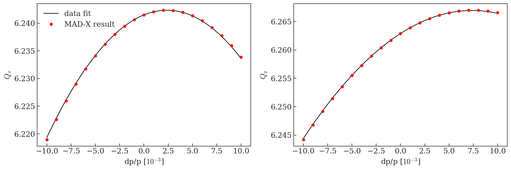

# AD chromaticity measurements


```python
%run /eos/project/l/liu/Toolbox/myToolbox.py

%config InlineBackend.figure_format = 'retina'

plt.rcParams["mathtext.fontset"] = "cm"
```

    Version 0.03. This is the latest version.
    Please help me to improve it reporting bugs to guido.sterbini@cern.ch.


    /eos/project/l/liu/Toolbox/myToolbox.py:24: FutureWarning: 'pandas.tseries.converter.register' has been moved and renamed to 'pandas.plotting.register_matplotlib_converters'. 
      converter.register()


    Your platform is Linux-3.10.0-957.21.3.el7.x86_64-x86_64-with-centos-7.6.1810-Core
    Your folder is /eos/user/a/ahuschau/www/chromaticity_measurements
    Your IP is 172.17.0.20
    2019-07-18 13:32:58


# AD magnetic cycle


```python
AD = myToolbox.japcMatlabImport('./measurement_data/AD/2018.10.29.12.12.28.355.mat')
```


```python
f, ax = plt.subplots(1, figsize = (8,5))

t = np.arange(AD.PR_BMEAS_B_SD.Samples.value.firstSampleTime, len(AD.PR_BMEAS_B_SD.Samples.value.samples)*AD.PR_BMEAS_B_SD.Samples.value.samplingTrain, AD.PR_BMEAS_B_SD.Samples.value.samplingTrain)
B = AD.PR_BMEAS_B_SD.Samples.value.samples/1e4
p = AD.PR_MOMENTUM_ST.Samples.value.samples/1e3
ax.plot(t, B)

ax2 = ax.twinx()
ax2.plot(t, p)

ax2.set_ylabel('Momentum [GeV/c]')

ax.set_xlabel('Cycle time [ms]')
ax.set_ylabel('Magnetic field [T]')

ax.set_xlim(0, 2400)
```


    (0, 2400)


# Chromaticity measurement

These measurements have been performed on 29.10.2018. Below is a screenshot of the entry in the reference logbook. Note the modification on the PR.W8L for measurement purposes. At 1100 ms the current was changed by +35 A (flat top configuration), for the configurations before extraction and extraction the current was changed by +10 A.


In the MAD-X matching these changes have been considered based on the PFW matrices, which predict the following tune changes:

dIW8L = 35A
- dQx = -0.021606068
- dQy = 0.020953456

dIW8L = 10A
- dQx = -0.006173162
- dQy = 0.005986702

## Before transition


```python
file_ = './measurement_data/AD/before_transition.csv'
Qxdp, Qx, Qydp, Qy = myToolbox.import_chromaticity(file_)
```


```python
Qx_fit = myToolbox.fit_chromaticity(Qxdp, Qx, 2)
Qy_fit = myToolbox.fit_chromaticity(Qydp, Qy, 2)
```


```python
f, ax = plt.subplots(1, figsize = (8,5))

ax.plot(Qx_fit['time'], Qx_fit['tune'], '-o', color = 'firebrick', label = '$Q_x$')
ax.plot(Qy_fit['time'], Qy_fit['tune'], '-o', color = 'royalblue', label = '$Q_y$')

ax.set_xlabel('Cycle time [ms]')
ax.set_ylabel('Tune')
ax.legend(frameon = False)
ax.set_xlim(160, 400)

ax2 = ax.twinx()
ax2.plot(t, p, 'k')
ax2.set_ylabel('Momentum [GeV/c]')
```


    (160, 400)


```python
f, ax = plt.subplots(1, figsize = (8,5))

ax.plot(Qx_fit['time'], Qx_fit['chromaticity'], '-o', color = 'firebrick', label = '$Q_x^\prime$')
ax.plot(Qy_fit['time'], Qy_fit['chromaticity'], '-o', color = 'royalblue', label = '$Q_y^\prime$')

ax.set_xlabel('Cycle time [ms]')
ax.set_ylabel('Chromaticity')
ax.legend(frameon = False)
ax.set_xlim(160, 400)

ax2 = ax.twinx()
ax2.plot(t, p, 'k')
ax2.set_ylabel('Momentum [GeV/c]')
```


    Text(0,0.5,'Momentum [GeV/c]')


```python
f, ax = plt.subplots(1, figsize = (8,5))

ax.plot(Qx_fit['time'], Qx_fit['nl_chromaticity'], '-o', color = 'firebrick', label = '$Q_x^{\prime\prime}$')
ax.plot(Qy_fit['time'], Qy_fit['nl_chromaticity'], '-o', color = 'royalblue', label = '$Q_y^{\prime\prime}$')

ax.set_xlabel('Cycle time [ms]')
ax.set_ylabel('Non-linear chromaticity')
ax.legend(frameon = False)
ax.set_xlim(160, 400)

ax2 = ax.twinx()
ax2.plot(t, p, 'k')
ax2.set_ylabel('Momentum [GeV/c]')
```


    Text(0,0.5,'Momentum [GeV/c]')


## After transition


```python
file_ = './measurement_data/AD/after_transition.csv'
Qxdp, Qx, Qydp, Qy = myToolbox.import_chromaticity(file_)
```


```python
Qx_fit2 = myToolbox.fit_chromaticity(Qxdp, Qx, 2)
Qy_fit2 = myToolbox.fit_chromaticity(Qydp, Qy, 2)
```


```python
f, ax = plt.subplots(1, figsize = (8,5))

ax.plot(Qx_fit2['time'], Qx_fit2['tune'], '-o', color = 'firebrick', label = '$Q_x$')
ax.plot(Qy_fit2['time'], Qy_fit2['tune'], '-o', color = 'royalblue', label = '$Q_y$')

ax.set_xlabel('Cycle time [ms]')
ax.set_ylabel('Tune')
ax.legend(frameon = False)
ax.set_xlim(160, 1200)

ax2 = ax.twinx()
ax2.plot(t, p, 'k')
ax2.set_ylabel('Momentum [GeV/c]')
```


    Text(0,0.5,'Momentum [GeV/c]')


```python
f, ax = plt.subplots(1, figsize = (8,5))

ax.plot(Qx_fit2['time'], Qx_fit2['chromaticity'], '-o', color = 'firebrick', label = '$Q_x^\prime$')
ax.plot(Qy_fit2['time'], Qy_fit2['chromaticity'], '-o', color = 'royalblue', label = '$Q_y^\prime$')

ax.set_xlabel('Cycle time [ms]')
ax.set_ylabel('Chromaticity')
ax.legend(frameon = False)
ax.set_xlim(160, 1200)

ax2 = ax.twinx()
ax2.plot(t, p, 'k')
ax2.set_ylabel('Momentum [GeV/c]')
```


    Text(0,0.5,'Momentum [GeV/c]')


```python
f, ax = plt.subplots(1, figsize = (8,5))

ax.plot(Qx_fit2['time'], Qx_fit2['nl_chromaticity'], '-o', color = 'firebrick', label = '$Q_x^{\prime\prime}$')
ax.plot(Qy_fit2['time'], Qy_fit2['nl_chromaticity'], '-o', color = 'royalblue', label = '$Q_y^{\prime\prime}$')

ax.set_xlabel('Cycle time [ms]')
ax.set_ylabel('Non-linear chromaticity')
ax.legend(frameon = False, loc = 'upper left')
ax.set_xlim(160, 1200)

ax2 = ax.twinx()
ax2.plot(t, p, 'k')
ax2.set_ylabel('Momentum [GeV/c]')
```


    Text(0,0.5,'Momentum [GeV/c]')


# Create MAD-X input

## Flat bottom


```python
idx = 1
print('Cycle time: ' + str(Qx_fit['time'].iloc[idx]) + ' ms') 

print('\nOnly the tunes are considered, as the higher orders are assumed to be unchanged wrt. the bare machine.\n')

aux = Qx_fit['coefficients'].iloc[1]
print('! Qx = ' + str(np.round(aux[2]-6, 5)) + ' + ' + str(np.round(aux[1], 5)) + '*x + ' + str(np.round(aux[0], 5)) + '*x^2')
print('Qx := ' + str(np.round(aux[2]-6, 5)) + ';')
# print('MQx1 := ' + str(np.round(aux[1], 5)) + ';')
# print('MQx2 := ' + str(np.round(aux[0], 5)) + ';')

print('')

aux = Qy_fit['coefficients'].iloc[1]
print('! Qy = ' + str(np.round(aux[2]-6, 5)) + ' + ' + str(np.round(aux[1], 5)) + '*x + ' + str(np.round(aux[0], 5)) + '*x^2')
print('Qy := ' + str(np.round(aux[2]-6, 5)) + ';')
# print('MQx1 := ' + str(np.round(aux[1], 5)) + ';')
# print('MQx2 := ' + str(np.round(aux[0], 5)) + ';')
```

    Cycle time: 176.0 ms
    
    Only the tunes are considered, as the higher orders are assumed to be unchanged wrt. the bare machine.
    
    ! Qx = 0.12811 + -4.95894*x + 26.39193*x^2
    Qx := 0.12811;
    
    ! Qy = 0.25893 + -7.37704*x + 36.77206*x^2
    Qy := 0.25893;


## Flat top (around 1100 ms)


```python
idx = -6
print('Horizontal measurement considered at ' + str(Qx_fit2['time'].iloc[idx]) + ' ms')
print('Vertical measurement considered at ' + str(Qy_fit2['time'].iloc[idx]) + ' ms')
```

    Horizontal measurement considered at 1104.0 ms
    Vertical measurement considered at 1099.0 ms


```python
aux = Qx_fit2['coefficients'].iloc[idx]
print('! Qx = ' + str(np.round(aux[2]-6, 5)) + ' + ' + str(np.round(aux[1], 5)) + '*x + ' + str(np.round(aux[0], 5)) + '*x^2')
print('Qx0 := ' + str(np.round(aux[2]-6, 5)) + ';')
print('Qx1 := ' + str(np.round(aux[1], 5)) + ';')
print('Qx2 := ' + str(np.round(aux[0], 5)) + ';')

print('')

aux = Qy_fit2['coefficients'].iloc[idx]
print('! Qy = ' + str(np.round(aux[2]-6, 5)) + ' + ' + str(np.round(aux[1], 5)) + '*x + ' + str(np.round(aux[0], 5)) + '*x^2')
print('Qy0 := ' + str(np.round(aux[2]-6, 5)) + ';')
print('Qy1 := ' + str(np.round(aux[1], 5)) + ';')
print('Qy2 := ' + str(np.round(aux[0], 5)) + ';')
```

    ! Qx = 0.2415 + 0.7141*x + -150.27302*x^2
    Qx0 := 0.2415;
    Qx1 := 0.7141;
    Qx2 := -150.27302;
    
    ! Qy = 0.2629 + 1.1024*x + -74.78295*x^2
    Qy0 := 0.2629;
    Qy1 := 1.1024;
    Qy2 := -74.78295;


## Before extraction (around 1145 ms)


```python
idx = [-2, -1]
print('Horizontal measurement considered at ' + str(Qx_fit2['time'].iloc[idx[0]]) + ' ms')
print('Vertical measurement considered at ' + str(Qy_fit2['time'].iloc[idx[1]]) + ' ms')
```

    Horizontal measurement considered at 1144.0 ms
    Vertical measurement considered at 1149.0 ms


```python
aux = Qx_fit2['coefficients'].iloc[idx[0]]
print('! Qx = ' + str(np.round(aux[2]-6, 5)) + ' + ' + str(np.round(aux[1], 5)) + '*x + ' + str(np.round(aux[0], 5)) + '*x^2')
print('Qx0 := ' + str(np.round(aux[2]-6, 5)) + ';')
print('Qx1 := ' + str(np.round(aux[1], 5)) + ';')
print('Qx2 := ' + str(np.round(aux[0], 5)) + ';')

print('')

aux = Qy_fit2['coefficients'].iloc[idx[1]]
print('! Qy = ' + str(np.round(aux[2]-6, 5)) + ' + ' + str(np.round(aux[1], 5)) + '*x + ' + str(np.round(aux[0], 5)) + '*x^2')
print('Qy0 := ' + str(np.round(aux[2]-6, 5)) + ';')
print('Qy1 := ' + str(np.round(aux[1], 5)) + ';')
print('Qy2 := ' + str(np.round(aux[0], 5)) + ';')
```

    ! Qx = 0.15095 + -1.02664*x + -372.27359*x^2
    Qx0 := 0.15095;
    Qx1 := -1.02664;
    Qx2 := -372.27359;
    
    ! Qy = 0.25136 + 0.38814*x + 152.03807*x^2
    Qy0 := 0.25136;
    Qy1 := 0.38814;
    Qy2 := 152.03807;


# Normalized harmonics coming from the magnetic model

The sextupolar components at the extremeties of the magnets and in the central junction are taken from the magnetic model.


```python
int_harm = pnd.read_pickle('/eos/project/l/liu/PS/magnetic_model/harmonics_vs_energy/Integrated_harmonics.pkl')

# current corresponding to flat top
current = 5386

folder = '/eos/project/l/liu/PS/magnetic_model/harmonics_vs_energy/Raw_data_Jaime/data_folder_' + str(current) + '/'
files = sorted(glob.glob(folder + '*.txt'))

# considering the field in the middle of the central block as reference
aux = pnd.read_table(files[0], header = None, delim_whitespace = True)
B = aux[aux[0] == -1100][1].values[0]

# (2*pi*100 - 80*1.6 - 20*3)/2/pi
rho = 70.078870699
Brho = B * rho
pMM = Brho/3.3356
p = np.max(AD.PR_MOMENTUM_ST.Samples.value.samples)/1e3

print('Field at ' + str(current) + ' A = ' + str(B) + ' T')
print('Momentum at ' + str(current) + ' A = ' + str(pMM) + ' GeV/c')
print('Brho at ' + str(current) + ' A = ' + str(Brho) + ' Tm')

# now calculating normalized integrated harmonics
norm_harm = int_harm[int_harm['current [A]'] == current].copy()
for col in norm_harm.columns[-6:]:
    norm_harm[col] = norm_harm[col]/Brho
```

    Field at 5386 A = 1.27396541 T
    Momentum at 5386 A = 26.76521682527537 GeV/c
    Brho at 5386 A = 89.27805724238853 Tm


```python
norm_harm
```


<div>
<style scoped>
    .dataframe tbody tr th:only-of-type {
        vertical-align: middle;
    }

    .dataframe tbody tr th {
        vertical-align: top;
    }

    .dataframe thead th {
        text-align: right;
    }
</style>
<table border="1" class="dataframe">
  <thead>
    <tr style="text-align: right;">
      <th></th>
      <th>current [A]</th>
      <th>z_ini [mm]</th>
      <th>z_end[mm]</th>
      <th>i_B1 [Tm]</th>
      <th>i_B2 [Tm]</th>
      <th>i_B3 [Tm]</th>
      <th>i_B4 [Tm]</th>
      <th>i_B5 [Tm]</th>
      <th>i_B6 [Tm]</th>
      <th>r_sample [m]</th>
      <th>B1</th>
      <th>B2</th>
      <th>B3</th>
      <th>B4</th>
      <th>B5</th>
      <th>B6</th>
    </tr>
  </thead>
  <tbody>
    <tr>
      <th>54</th>
      <td>5386</td>
      <td>-4000.0</td>
      <td>-1926.3</td>
      <td>0.330422</td>
      <td>-0.026669</td>
      <td>-0.000766</td>
      <td>0.000017</td>
      <td>1.281273e-06</td>
      <td>1.434717e-06</td>
      <td>0.025</td>
      <td>0.003701</td>
      <td>-0.011949</td>
      <td>-0.027459</td>
      <td>0.072132</td>
      <td>0.881755</td>
      <td>197.470743</td>
    </tr>
    <tr>
      <th>55</th>
      <td>5386</td>
      <td>-1926.3</td>
      <td>-218.5</td>
      <td>2.161344</td>
      <td>-0.213416</td>
      <td>-0.002023</td>
      <td>0.000169</td>
      <td>-2.778815e-05</td>
      <td>1.148784e-05</td>
      <td>0.025</td>
      <td>0.024209</td>
      <td>-0.095619</td>
      <td>-0.072493</td>
      <td>0.726034</td>
      <td>-19.123443</td>
      <td>1581.157129</td>
    </tr>
    <tr>
      <th>56</th>
      <td>5386</td>
      <td>-218.5</td>
      <td>0.0</td>
      <td>0.274790</td>
      <td>-0.024225</td>
      <td>-0.000322</td>
      <td>0.000257</td>
      <td>-1.653024e-06</td>
      <td>-5.846849e-06</td>
      <td>0.025</td>
      <td>0.003078</td>
      <td>-0.010854</td>
      <td>-0.011547</td>
      <td>1.103618</td>
      <td>-1.137590</td>
      <td>-804.745127</td>
    </tr>
    <tr>
      <th>57</th>
      <td>5386</td>
      <td>0.0</td>
      <td>218.5</td>
      <td>0.274620</td>
      <td>0.024213</td>
      <td>-0.000314</td>
      <td>-0.000256</td>
      <td>-1.739389e-06</td>
      <td>5.813155e-06</td>
      <td>0.025</td>
      <td>0.003076</td>
      <td>0.010848</td>
      <td>-0.011253</td>
      <td>-1.101923</td>
      <td>-1.197025</td>
      <td>800.107571</td>
    </tr>
    <tr>
      <th>58</th>
      <td>5386</td>
      <td>218.5</td>
      <td>1918.3</td>
      <td>2.153596</td>
      <td>0.212972</td>
      <td>-0.001909</td>
      <td>-0.000153</td>
      <td>-2.258288e-05</td>
      <td>-1.141741e-05</td>
      <td>0.025</td>
      <td>0.024122</td>
      <td>0.095420</td>
      <td>-0.068414</td>
      <td>-0.659595</td>
      <td>-15.541248</td>
      <td>-1571.463288</td>
    </tr>
    <tr>
      <th>59</th>
      <td>5386</td>
      <td>1918.3</td>
      <td>4000.0</td>
      <td>0.328127</td>
      <td>0.026676</td>
      <td>-0.000753</td>
      <td>-0.000026</td>
      <td>-5.676241e-07</td>
      <td>-9.211961e-07</td>
      <td>0.025</td>
      <td>0.003675</td>
      <td>0.011952</td>
      <td>-0.026999</td>
      <td>-0.111203</td>
      <td>-0.390632</td>
      <td>-126.791033</td>
    </tr>
  </tbody>
</table>
</div>


## Sextupole components for the multipoles


```python
# entry and exit 
mpk2 = (norm_harm['B3'].iloc[0] + norm_harm['B3'].iloc[-1])/2

# junction
mpk2_j = norm_harm['B3'].iloc[2:4].sum()

print('mpk2               =  ' + str(mpk2) + ' ;')
print('mpk2_j             =   ' + str(mpk2_j) + ' ;')
```

    mpk2               =  -0.027229131451032493 ;
    mpk2_j             =   -0.022799207362532346 ;


# Comparison between MAD-X output and measurements

## Flat top (around 1100 ms)


```python
mad = metaclass.twiss('/eos/user/a/ahuschau/www/PS/2019/scenarios/AD/2_flat_top/PS_FT_AD_chromaticity_summary.out')

idx = -6
dQx = -0.021606068
dQy = 0.020953456

f, ax = plt.subplots(1,2, figsize = (16, 5))

p = np.poly1d(Qx_fit2['coefficients'].iloc[idx])
dp = np.linspace(-0.01, 0.01, 100)
ax[0].plot(dp*1e3, p(dp), 'k', label = 'data fit')
ax[0].plot(mad.DP0*1e3, mad.QX+6+dQx, 'or', label = 'MAD-X result')
ax[0].legend(frameon = False)

p = np.poly1d(Qy_fit2['coefficients'].iloc[idx])
dp = np.linspace(-0.01, 0.01, 100)
ax[1].plot(dp*1e3, p(dp), 'k')
ax[1].plot(mad.DP0*1e3, mad.QY+6+dQy, 'or')

ylabel = ['$Q_x$', '$Q_y$']
for i in xrange(2):
    ax[i].set_xlabel('dp/p [$10^{-3}$]')
    ax[i].set_ylabel(ylabel[i])
```

    alllabels 4





## Before extraction (around 1145 ms)


```python
mad = metaclass.twiss('/eos/user/a/ahuschau/www/PS/2019/scenarios/AD/3_before_extraction/PS_BEF_EXT_AD_chromaticity_summary.out')

dQx = -0.006173162
dQy = 0.005986702

f, ax = plt.subplots(1,2, figsize = (16, 5))

p = np.poly1d(Qx_fit2['coefficients'].iloc[-2])
dp = np.linspace(-0.01, 0.01, 100)
ax[0].plot(dp*1e3, p(dp), 'k', label = 'data fit')
ax[0].plot(mad.DP0*1e3, mad.QX+6+dQx, 'or', label = 'MAD-X result')
ax[0].legend(frameon = False)

p = np.poly1d(Qy_fit2['coefficients'].iloc[-1])
dp = np.linspace(-0.01, 0.01, 100)
ax[1].plot(dp*1e3, p(dp), 'k')
ax[1].plot(mad.DP0*1e3, mad.QY+6+dQy, 'or')

ylabel = ['$Q_x$', '$Q_y$']
for i in xrange(2):
    ax[i].set_xlabel('dp/p [$10^{-3}$]')
    ax[i].set_ylabel(ylabel[i])
```

    alllabels 4


```python
!jupyter nbconvert --to markdown --output-dir='../test-acc-models/repository/PS/2019/scenarios/AD/' AD_chromaticity_measurement.ipynb
```

    [NbConvertApp] Converting notebook AD_chromaticity_measurement.ipynb to markdown
    [NbConvertApp] Support files will be in AD_chromaticity_measurement_files/
    [NbConvertApp] Making directory ../test-acc-models/repository/PS/2019/scenarios/AD/AD_chromaticity_measurement_files
    [NbConvertApp] Making directory ../test-acc-models/repository/PS/2019/scenarios/AD/AD_chromaticity_measurement_files
    [NbConvertApp] Making directory ../test-acc-models/repository/PS/2019/scenarios/AD/AD_chromaticity_measurement_files
    [NbConvertApp] Making directory ../test-acc-models/repository/PS/2019/scenarios/AD/AD_chromaticity_measurement_files
    [NbConvertApp] Making directory ../test-acc-models/repository/PS/2019/scenarios/AD/AD_chromaticity_measurement_files
    [NbConvertApp] Making directory ../test-acc-models/repository/PS/2019/scenarios/AD/AD_chromaticity_measurement_files
    [NbConvertApp] Making directory ../test-acc-models/repository/PS/2019/scenarios/AD/AD_chromaticity_measurement_files
    [NbConvertApp] Making directory ../test-acc-models/repository/PS/2019/scenarios/AD/AD_chromaticity_measurement_files
    [NbConvertApp] Making directory ../test-acc-models/repository/PS/2019/scenarios/AD/AD_chromaticity_measurement_files
    [NbConvertApp] Writing 18124 bytes to ../test-acc-models/repository/PS/2019/scenarios/AD/AD_chromaticity_measurement.md

