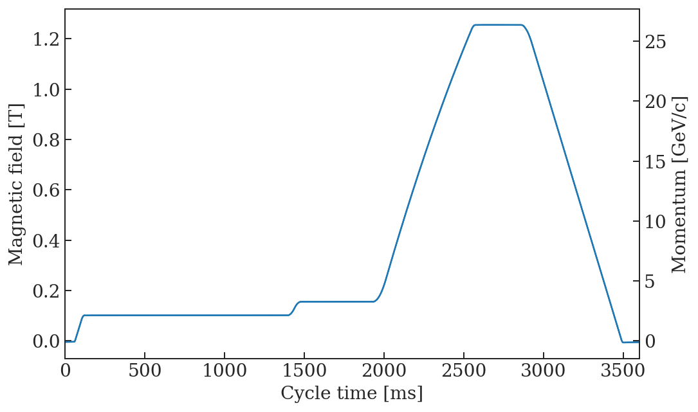
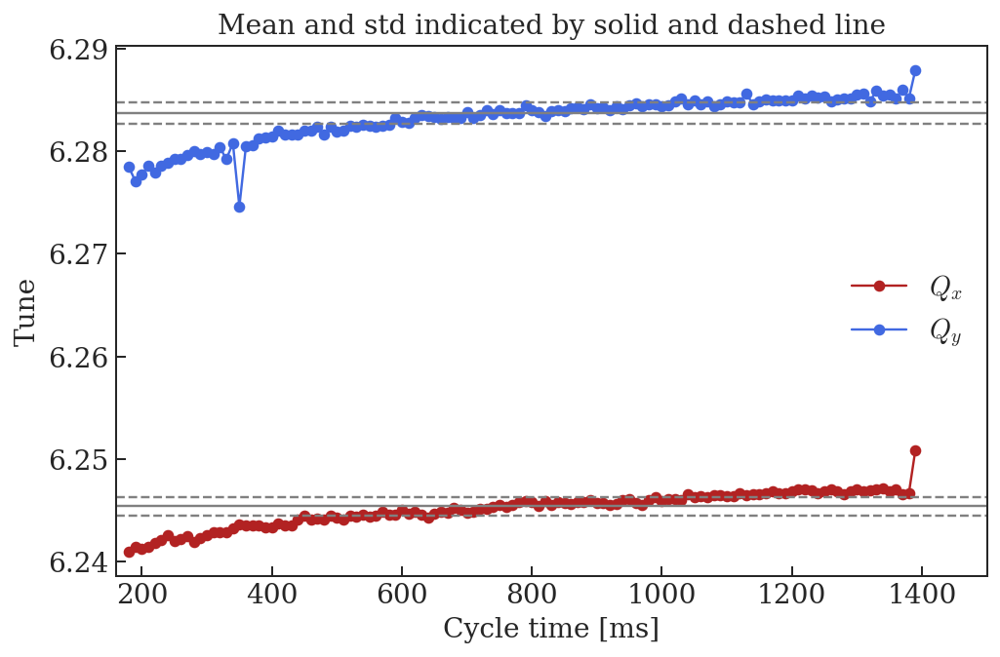
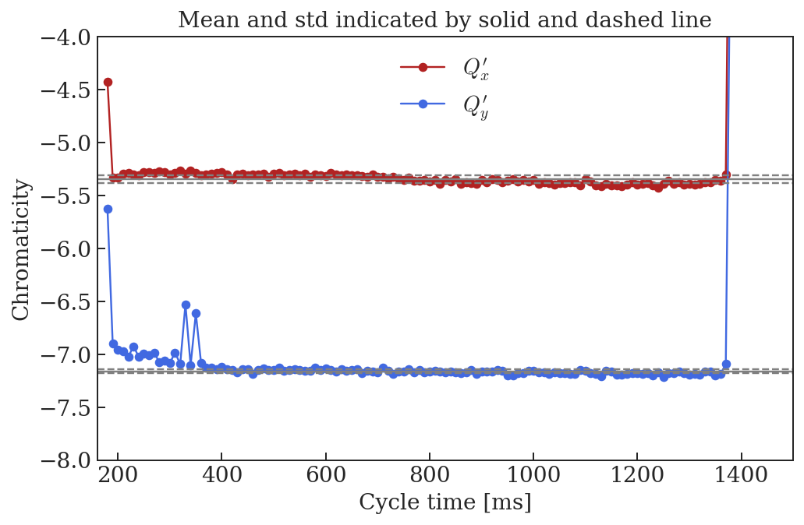
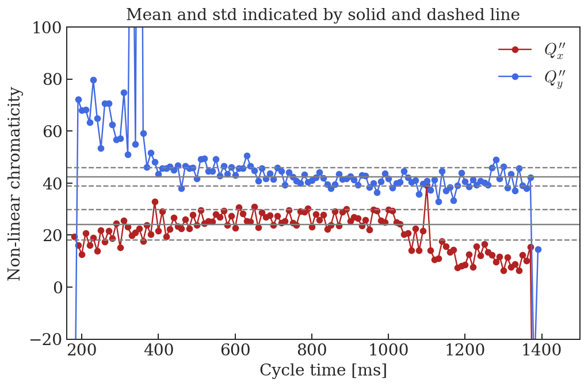
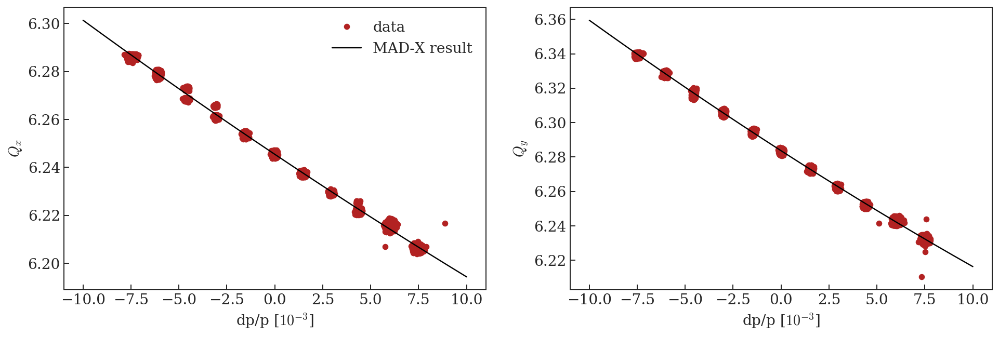

# Bare machine chromaticity measurements


```python
%run /eos/project/l/liu/Toolbox/myToolbox.py

%config InlineBackend.figure_format = 'retina'

plt.rcParams["mathtext.fontset"] = "cm"

import csv
```

    Version 0.03. This is the latest version.
    Please help me to improve it reporting bugs to guido.sterbini@cern.ch.


    /eos/project/l/liu/Toolbox/myToolbox.py:24: FutureWarning: 'pandas.tseries.converter.register' has been moved and renamed to 'pandas.plotting.register_matplotlib_converters'. 
      converter.register()


    Your platform is Linux-3.10.0-957.21.3.el7.x86_64-x86_64-with-centos-7.6.1810-Core
    Your folder is /eos/user/a/ahuschau/www/chromaticity_measurements
    Your IP is 172.17.0.20
    2019-07-18 14:18:40


# LHC magnetic cycle

Chromaticity measurements were performed at the long flat bottom of an LHC cycle on 09.04.2018.


```python
LHC = myToolbox.japcMatlabImport('./measurement_data/bare_machine/2018.11.01.16.29.29.097.mat')
```


```python
f, ax = plt.subplots(1, figsize = (8,5))

t = np.arange(LHC.PR_BMEAS_B_SD.Samples.value.firstSampleTime, len(LHC.PR_BMEAS_B_SD.Samples.value.samples)*LHC.PR_BMEAS_B_SD.Samples.value.samplingTrain, LHC.PR_BMEAS_B_SD.Samples.value.samplingTrain)
B = LHC.PR_BMEAS_B_SD.Samples.value.samples/1e4
p = LHC.PR_MOMENTUM_ST.Samples.value.samples/1e3
ax.plot(t, B)

ax2 = ax.twinx()
ax2.plot(t, p)

ax2.set_ylabel('Momentum [GeV/c]')

ax.set_xlabel('Cycle time [ms]')
ax.set_ylabel('Magnetic field [T]')

ax.set_xlim(0, 3600)
```


    (0, 3600)





# Chromaticity measurement


```python
files = sorted(glob.glob('./measurement_data/bare_machine/*.csv'))
```


```python
Qxdp, Qx, _, _ = myToolbox.import_chromaticity(files[0])
_, _, Qydp, Qy = myToolbox.import_chromaticity(files[1])
```


```python
Qx_fit = myToolbox.fit_chromaticity(Qxdp, Qx, 2)
Qy_fit = myToolbox.fit_chromaticity(Qydp, Qy, 2)
```


```python
f, ax = plt.subplots(1, figsize = (8,5))

ax.plot(Qx_fit['time'], Qx_fit['tune'], '-o', color = 'firebrick', label = '$Q_x$')
ax.plot(Qy_fit['time'], Qy_fit['tune'], '-o', color = 'royalblue', label = '$Q_y$')

m = []
s = []

for i,Q in enumerate([Qx_fit, Qy_fit]):
    m.append(Q[(Q['time'] > 390) & (Q['time'] < 1210)]['tune'].mean())
    s.append(Q[(Q['time'] > 390) & (Q['time'] < 1210)]['tune'].std())

    ax.axhline(m[i], color = 'grey', linestyle = '-')
    ax.axhline(m[i]-s[i], color = 'grey', linestyle = '--')
    ax.axhline(m[i]+s[i], color = 'grey', linestyle = '--')

ax.set_xlabel('Cycle time [ms]')
ax.set_ylabel('Tune')
ax.legend(frameon = False)
ax.set_xlim(160, 1500)
ax.set_title('Mean and std indicated by solid and dashed line')

# ax2 = ax.twinx()
# ax2.plot(t, p, 'k')
# ax2.set_ylabel('Momentum [GeV/c]')
```


    Text(0.5,1,'Mean and std indicated by solid and dashed line')





```python
f, ax = plt.subplots(1, figsize = (8,5))

ax.plot(Qx_fit['time'], Qx_fit['chromaticity'], '-o', color = 'firebrick', label = '$Q_x^{\prime}$')
ax.plot(Qy_fit['time'], Qy_fit['chromaticity'], '-o', color = 'royalblue', label = '$Q_y^{\prime}$')

m2 = []
s2 = []

for i,Q in enumerate([Qx_fit, Qy_fit]):
    m2.append(Q[(Q['time'] > 390) & (Q['time'] < 1210)]['chromaticity'].mean())
    s2.append(Q[(Q['time'] > 390) & (Q['time'] < 1210)]['chromaticity'].std())

    ax.axhline(m2[i], color = 'grey', linestyle = '-')
    ax.axhline(m2[i]-s2[i], color = 'grey', linestyle = '--')
    ax.axhline(m2[i]+s2[i], color = 'grey', linestyle = '--')

ax.set_xlabel('Cycle time [ms]')
ax.set_ylabel('Chromaticity')
ax.legend(frameon = False)
ax.set_xlim(160, 1500)
ax.set_ylim(-8, -4)
ax.set_title('Mean and std indicated by solid and dashed line')

# ax2 = ax.twinx()
# ax2.plot(t, p, 'k')
# ax2.set_ylabel('Momentum [GeV/c]')
```


    Text(0.5,1,'Mean and std indicated by solid and dashed line')





```python
f, ax = plt.subplots(1, figsize = (8,5))

ax.plot(Qx_fit['time'], Qx_fit['nl_chromaticity'], '-o', color = 'firebrick', label = '$Q_x^{\prime\prime}$')
ax.plot(Qy_fit['time'], Qy_fit['nl_chromaticity'], '-o', color = 'royalblue', label = '$Q_y^{\prime\prime}$')

m3 = []
s3 = []

for i,Q in enumerate([Qx_fit, Qy_fit]):
    m3.append(Q[(Q['time'] > 390) & (Q['time'] < 1210)]['nl_chromaticity'].mean())
    s3.append(Q[(Q['time'] > 390) & (Q['time'] < 1210)]['nl_chromaticity'].std())

    ax.axhline(m3[i], color = 'grey', linestyle = '-')
    ax.axhline(m3[i]-s3[i], color = 'grey', linestyle = '--')
    ax.axhline(m3[i]+s3[i], color = 'grey', linestyle = '--')

ax.set_xlabel('Cycle time [ms]')
ax.set_ylabel('Non-linear chromaticity')
ax.legend(frameon = False)
ax.set_xlim(160, 1500)
ax.set_ylim(-20, 100)
ax.set_title('Mean and std indicated by solid and dashed line')

# ax2 = ax.twinx()
# ax2.plot(t, p, 'k')
# ax2.set_ylabel('Momentum [GeV/c]')
```


    Text(0.5,1,'Mean and std indicated by solid and dashed line')





# Create MAD-X input


```python
print('! Qx = ' + str(np.round(m[0]-6, 5)) + ' + ' + str(np.round(m2[0], 5)) + '*x + ' + str(np.round(m3[0], 5)) + '*x^2')
print('Qx0 := ' + str(np.round(m[0]-6, 5)) + ';')
print('Qx1 := ' + str(np.round(m2[0], 5)) + ';')
print('Qx2 := ' + str(np.round(m3[0], 5)) + ';')

print('')

print('! Qy = ' + str(np.round(m[1]-6, 5)) + ' + ' + str(np.round(m2[1], 5)) + '*x + ' + str(np.round(m3[1], 5)) + '*x^2')
print('Qy0 := ' + str(np.round(m[1]-6, 5)) + ';')
print('Qy1 := ' + str(np.round(m2[1], 5)) + ';')
print('Qy2 := ' + str(np.round(m3[1], 5)) + ';')
```

    ! Qx = 0.2454 + -5.34645*x + 24.03831*x^2
    Qx0 := 0.2454;
    Qx1 := -5.34645;
    Qx2 := 24.03831;
    
    ! Qy = 0.28368 + -7.16314*x + 42.3747*x^2
    Qy0 := 0.28368;
    Qy1 := -7.16314;
    Qy2 := 42.3747;


# Comparison between MAD-X output and measurements


```python
mad = metaclass.twiss('/eos/user/a/ahuschau/www/PS/2019/scenarios/bare_machine/0_flat_bottom/PS_FB_bare_machine_chromaticity_summary.out')

f, ax = plt.subplots(1,2, figsize = (16, 5))

for c in Qx.columns[24:105]:
    ax[0].plot(Qxdp[c]*1e3, Qx[c], 'o', color = 'firebrick', label = '__nolegend__')
ax[0].plot(Qxdp[c]*1e3, Qx[c], 'o', color = 'firebrick', label = 'data')
ax[0].plot(mad.DP0*1e3, mad.QX+6, 'k-', label = 'MAD-X result')
ax[0].legend(frameon = False)

for c in Qy.columns[24:105]:
    ax[1].plot(Qydp[c]*1e3, Qy[c], 'o', color = 'firebrick', label = '__nolegend__')
ax[1].plot(Qydp[c]*1e3, Qy[c], 'o', color = 'firebrick', label = 'data')
ax[1].plot(mad.DP0*1e3, mad.QY+6, 'k-', label = 'MAD-X result')

ylabel = ['$Q_x$', '$Q_y$']
for i in xrange(2):
    ax[i].set_xlabel('dp/p [$10^{-3}$]')
    ax[i].set_ylabel(ylabel[i])

```

    alllabels 4





```python
!jupyter nbconvert --to markdown --output-dir='../test-acc-models/repository/PS/2019/scenarios/Bare_machine/' bare_machine_chromaticity_measurement.ipynb
```

    [NbConvertApp] Converting notebook bare_machine_chromaticity_measurement.ipynb to markdown
    [NbConvertApp] Support files will be in bare_machine_chromaticity_measurement_files/
    [NbConvertApp] Making directory ../test-acc-models/repository/PS/2019/scenarios/Bare_machine/bare_machine_chromaticity_measurement_files
    [NbConvertApp] Making directory ../test-acc-models/repository/PS/2019/scenarios/Bare_machine/bare_machine_chromaticity_measurement_files
    [NbConvertApp] Making directory ../test-acc-models/repository/PS/2019/scenarios/Bare_machine/bare_machine_chromaticity_measurement_files
    [NbConvertApp] Making directory ../test-acc-models/repository/PS/2019/scenarios/Bare_machine/bare_machine_chromaticity_measurement_files
    [NbConvertApp] Making directory ../test-acc-models/repository/PS/2019/scenarios/Bare_machine/bare_machine_chromaticity_measurement_files

