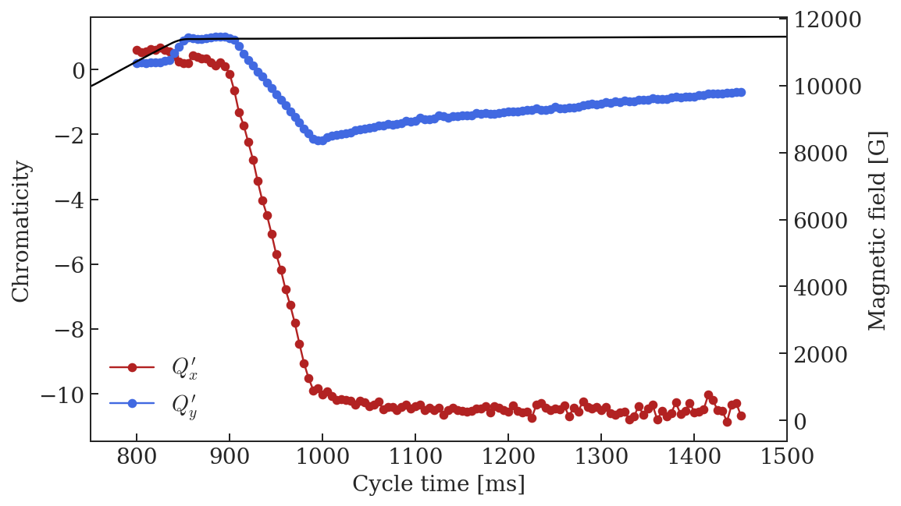

```python
%run /eos/project/l/liu/Toolbox/myToolbox.py

%config InlineBackend.figure_format = 'retina'

plt.rcParams["mathtext.fontset"] = "cm"
```

    Version 0.03. This is the latest version.
    Please help me to improve it reporting bugs to guido.sterbini@cern.ch.


    /eos/project/l/liu/Toolbox/myToolbox.py:24: FutureWarning: 'pandas.tseries.converter.register' has been moved and renamed to 'pandas.plotting.register_matplotlib_converters'. 
      converter.register()


    Your platform is Linux-3.10.0-957.21.3.el7.x86_64-x86_64-with-centos-7.6.1810-Core
    Your folder is /eos/home-a/ahuschau/www/chromaticity_measurements
    Your IP is 172.17.0.4
    2019-08-21 08:37:11


# EAST2 magnetic cycle

Note the slight ramp on the magnetic field at flat top to slowly extract the beam. The W8L goes to zero from 900 ms and the chromaticity is changed with the D and F circuit to prepare for the slow extraction.


```python
EAST = myToolbox.japcMatlabImport('./measurement_data/EAST2/2018.10.26.14.45.20.744.mat')
```


```python
f, ax = plt.subplots(1, figsize = (8,5))

t = np.arange(EAST.PR_BMEAS_B_SD.Samples.value.firstSampleTime, 2400., 0.1)
p = EAST.PR_MOMENTUM_ST.Samples.value.samples
plt.plot(t, p/1e3)

ax.set_xlabel('Cycle time [ms]')
ax.set_ylabel('Momentum [GeV/c]')

```


```python
f, ax = plt.subplots(1, figsize = (8,5))

ax.plot(t, EAST.PR_W8L.LOG_OASIS_I_MEAS.value.DATA, label = 'W8L')
ax.plot(t, EAST.PR_WDNP.LOG_OASIS_I_MEAS.value.DATA, label = 'WD')
ax.plot(t, EAST.PR_WFNP.LOG_OASIS_I_MEAS.value.DATA, label = 'WF')
# ax.plot(t, EAST.PR_WDW.LOG_OASIS_I_MEAS.value.DATA, label = 'WDW')
# ax.plot(t, EAST.PR_WFW.LOG_OASIS_I_MEAS.value.DATA, label = 'WFW')

ax2 = ax.twinx()
ax2.plot(t, B, 'k')
ax2.set_ylim(0, 11700)

ax.set_xlabel('Cycle time [ms]')
ax.set_ylabel('Current [A]')
ax2.set_ylabel('Magnetic field [G]')
ax.legend(frameon = False, loc = 'upper left')

ax.set_xlim(160, 1600)
```


    (160, 1600)


# Chromaticity measurements

These measurements have been performed in the beginning of November 2018. Below are screenshots of the entries in the reference logbook.  


## From injection to extraction of the parasitic TOF

Before transition energy a lineaar fit appears adequate, later on a quadratic fit is performed.


```python
file_ = './measurement_data/EAST2/chroma_hor_vert_170_690.csv'
Qxdp, Qx, Qydp, Qy = myToolbox.import_chromaticity(file_)
```


```python
NUM_COLORS = len(Qx)

cm = plt.get_cmap('Reds')

f, ax = plt.subplots(1, figsize = (8,5))

for i, c in enumerate(Qx.columns[2:]):
    col = cm(1.*i/len(Qx))
    ax.plot(Qxdp[c]*1e3, Qx[c], '-o', color = col)

cm = plt.get_cmap('Blues')
for i, c in enumerate(Qy.columns[2:]):
    col = cm(1.*i/len(Qx))
    ax.plot(Qydp[c]*1e3, Qy[c], '-o', color = col)
    
ax.set_xlabel('dp/p [$10^{-3}$]')
ax.set_ylabel('Tune')
ax.set_xlim(-10, 10)
```


    (-10, 10)


```python
# Linear fit at low energy, quadratic from transition on
Qx_fit = myToolbox.fit_chromaticity(Qxdp, Qx, 2)
Qy_fit = myToolbox.fit_chromaticity(Qydp, Qy, 2)

auxX = myToolbox.fit_chromaticity(Qxdp, Qx, 1)
auxY = myToolbox.fit_chromaticity(Qydp, Qy, 1)

Qx_fit.iloc[:23] = auxX.iloc[:23]
Qy_fit.iloc[:23] = auxY.iloc[:23]

Qx_fit['nl_chromaticity'].iloc[:23] = 0.0
Qy_fit['nl_chromaticity'].iloc[:23] = 0.0
```

    /cvmfs/sft.cern.ch/lcg/views/LCG_95a/x86_64-centos7-gcc8-opt/lib/python2.7/site-packages/pandas/core/indexing.py:189: SettingWithCopyWarning: 
    A value is trying to be set on a copy of a slice from a DataFrame
    
    See the caveats in the documentation: http://pandas.pydata.org/pandas-docs/stable/indexing.html#indexing-view-versus-copy
      self._setitem_with_indexer(indexer, value)


```python
f, ax = plt.subplots(1, figsize = (8,5))

ax.plot(Qx_fit['time'], Qx_fit['tune'], '-o', color = 'firebrick', label = '$Q_x$')

ax.plot(Qy_fit['time'], Qy_fit['tune'], '-o', color = 'royalblue', label = '$Q_y$')

ax2 = ax.twinx()
ax2.plot(t, B, 'k')
ax2.set_ylim(0, 10000)

ax.set_xlabel('Cycle time [ms]')
ax.set_ylabel('Tune')
ax2.set_ylabel('Magnetic field [G]')
ax.legend(frameon = False)

ax.set_xlim(160, 735)
```


    (160, 735)


```python
f, ax = plt.subplots(1, figsize = (8,5))

ax.plot(Qx_fit['time'], Qx_fit['chromaticity'], '-o', color = 'firebrick', label = '$Q_x^\prime$')

ax.plot(Qy_fit['time'], Qy_fit['chromaticity'], '-o', color = 'royalblue', label = '$Q_y^\prime$')

ax2 = ax.twinx()
ax2.plot(t, B, 'k')
ax2.set_ylim(0, 10000)

ax.set_xlabel('Cycle time [ms]')
ax.set_ylabel('Chromaticity')
ax2.set_ylabel('Magnetic field [G]')
ax.legend(frameon = False)

ax.set_xlim(160, 735)
ax.set_ylim(-10, 4)
```


    (-10, 4)


```python
f, ax = plt.subplots(1, figsize = (8,5))

ax.plot(Qx_fit['time'], Qx_fit['nl_chromaticity'], '-o', color = 'firebrick', label = '$Q_x^{\prime\prime}$')

ax.plot(Qy_fit['time'], Qy_fit['nl_chromaticity'], '-o', color = 'royalblue', label = '$Q_y^{\prime\prime}$')

ax2 = ax.twinx()
ax2.plot(t, B, 'k')
ax2.set_ylim(0, 10000)

ax.set_xlabel('Cycle time [ms]')
ax.set_ylabel('Non-linear chromaticity')
ax2.set_ylabel('Magnetic field [G]')
ax.legend(frameon = False, loc = 'upper left')

ax.set_xlim(160, 735)
ax.set_ylim(-200, 200)
```


    (-200, 200)


## Start of flat top

The PFW are at their nominal values until 900 ms, when they start to decrease for the slow extraction setup.


```python
file_ = './measurement_data/EAST2/chroma_hor_vert_710_900.csv'
Qxdp, Qx, Qydp, Qy = myToolbox.import_chromaticity(file_)
```


```python
NUM_COLORS = len(Qx)

cm = plt.get_cmap('Reds')

f, ax = plt.subplots(1, figsize = (8,5))

for i, c in enumerate(Qx.columns[2:]):
    col = cm(1.*i/len(Qx))
    ax.plot(Qxdp[c]*1e3, Qx[c], '-o', color = col)

cm = plt.get_cmap('Blues')
for i, c in enumerate(Qy.columns[2:]):
    col = cm(1.*i/len(Qx))
    ax.plot(Qydp[c]*1e3, Qy[c], '-o', color = col)
    
ax.set_xlabel('dp/p [$10^{-3}$]')
ax.set_ylabel('Tune')
ax.set_xlim(-10, 10)
```


    (-10, 10)


```python
Qx_fit = myToolbox.fit_chromaticity(Qxdp, Qx, 2)
Qy_fit = myToolbox.fit_chromaticity(Qydp, Qy, 2)
```


```python
f, ax = plt.subplots(1, figsize = (8,5))

ax.plot(Qx_fit['time'], Qx_fit['tune'], '-o', color = 'firebrick', label = '$Q_x$')

ax.plot(Qy_fit['time'], Qy_fit['tune'], '-o', color = 'royalblue', label = '$Q_y$')

ax2 = ax.twinx()
ax2.plot(t, B, 'k')
# ax2.set_ylim(0, 10000)

ax.set_xlabel('Cycle time [ms]')
ax.set_ylabel('Tune')
ax2.set_ylabel('Magnetic field [G]')
ax.legend(frameon = False, loc = 'lower right')

ax.set_xlim(650, 950)
```


    (650, 950)


```python
f, ax = plt.subplots(1, figsize = (8,5))

ax.plot(Qx_fit['time'], Qx_fit['chromaticity'], '-o', color = 'firebrick', label = '$Q_x^\prime$')

ax.plot(Qy_fit['time'], Qy_fit['chromaticity'], '-o', color = 'royalblue', label = '$Q_y^\prime$')

ax2 = ax.twinx()
ax2.plot(t, B, 'k')
# ax2.set_ylim(0, 10000)

ax.set_xlabel('Cycle time [ms]')
ax.set_ylabel('Chromaticity')
ax2.set_ylabel('Magnetic field [G]')
ax.legend(frameon = False)

ax.set_xlim(650, 950)
# ax.set_ylim(-10, 4)
```


    (650, 950)


```python
f, ax = plt.subplots(1, figsize = (8,5))

ax.plot(Qx_fit['time'], Qx_fit['nl_chromaticity'], '-o', color = 'firebrick', label = '$Q_x^{\prime\prime}$')

ax.plot(Qy_fit['time'], Qy_fit['nl_chromaticity'], '-o', color = 'royalblue', label = '$Q_y^{\prime\prime}$')

ax2 = ax.twinx()
ax2.plot(t, B, 'k')
# ax2.set_ylim(0, 10000)

ax.set_xlabel('Cycle time [ms]')
ax.set_ylabel('Non-linear chromaticity')
ax2.set_ylabel('Magnetic field [G]')
ax.legend(frameon = False, loc = 'upper left')

ax.set_xlim(650, 950)
# ax.set_ylim(-200, 200)
```


    (650, 950)


## Flat top before slow extraction (PFW only, no QSE, XSE)

The W8L is at zero and the D and F circuits are used to control chromaticity. QSE and XSE are only used in the next step to bring the beam into resonance.


```python
file_horizontal = './measurement_data/EAST2/chroma_horizontal_PFW_only.csv'
file_vertical = './measurement_data/EAST2/chroma_vertical_PFW_only.csv'

Qxdp, Qx, _, _  = myToolbox.import_chromaticity(file_horizontal)
_, _, Qydp, Qy = myToolbox.import_chromaticity(file_vertical)
```


```python
NUM_COLORS = len(Qx)

cm = plt.get_cmap('Reds')

f, ax = plt.subplots(1, figsize = (8,5))

for i, c in enumerate(Qx.columns[2:]):
    col = cm(1.*i/len(Qx))
    ax.plot(Qxdp[c]*1e3, Qx[c], '-o', color = col)

cm = plt.get_cmap('Blues')
for i, c in enumerate(Qy.columns[2:]):
    col = cm(1.*i/len(Qx))
    ax.plot(Qydp[c]*1e3, Qy[c], '-o', color = col)
    
ax.set_xlabel('dp/p [$10^{-3}$]')
ax.set_ylabel('Tune')
ax.set_xlim(-10, 10)
```


    (-10, 10)


```python
Qx_fit = myToolbox.fit_chromaticity(Qxdp, Qx, 2)
Qy_fit = myToolbox.fit_chromaticity(Qydp, Qy, 2)
```


```python
f, ax = plt.subplots(1, figsize = (8,5))

ax.plot(Qx_fit['time'], Qx_fit['tune'], '-o', color = 'firebrick', label = '$Q_x$')

ax.plot(Qy_fit['time'], Qy_fit['tune'], '-o', color = 'royalblue', label = '$Q_y$')

ax2 = ax.twinx()
ax2.plot(t, B, 'k')
# ax2.set_ylim(0, 10000)

ax.set_xlabel('Cycle time [ms]')
ax.set_ylabel('Tune')
ax2.set_ylabel('Magnetic field [G]')
ax.legend(frameon = False, loc = 'upper right')

ax.set_xlim(750, 1500)
```


    (750, 1500)


```python
f, ax = plt.subplots(1, figsize = (8,5))

ax.plot(Qx_fit['time'], Qx_fit['chromaticity'], '-o', color = 'firebrick', label = '$Q_x^\prime$')

ax.plot(Qy_fit['time'], Qy_fit['chromaticity'], '-o', color = 'royalblue', label = '$Q_y^\prime$')

ax2 = ax.twinx()
ax2.plot(t, B, 'k')
# ax2.set_ylim(0, 10000)

ax.set_xlabel('Cycle time [ms]')
ax.set_ylabel('Chromaticity')
ax2.set_ylabel('Magnetic field [G]')
ax.legend(frameon = False)

ax.set_xlim(750, 1500)
# ax.set_ylim(-10, 4)
```


    (750, 1500)





```python
f, ax = plt.subplots(1, figsize = (8,5))

ax.plot(Qx_fit['time'], Qx_fit['nl_chromaticity'], '-o', color = 'firebrick', label = '$Q_x^{\prime\prime}$')

ax.plot(Qy_fit['time'], Qy_fit['nl_chromaticity'], '-o', color = 'royalblue', label = '$Q_y^{\prime\prime}$')

ax2 = ax.twinx()
ax2.plot(t, B, 'k')
# ax2.set_ylim(0, 10000)

ax.set_xlabel('Cycle time [ms]')
ax.set_ylabel('Non-linear chromaticity')
ax2.set_ylabel('Magnetic field [G]')
ax.legend(frameon = False, loc = 'lower left')

ax.set_xlim(750, 1500)
# ax.set_ylim(-200, 200)
```


    (750, 1500)


## Flat top with PFW and XSE


```python
ts1 = datetime.datetime(2018, 11, 3, 0)
ts2 = datetime.datetime(2018, 11, 3, 1)
[f for f in log.getFundamentals(log.toTimestamp(ts1), log.toTimestamp(ts2), 'CPS%')]

```


    [u'CPS:AD:AD',
     u'CPS:AD_CLONE:MD3',
     u'CPS:EAST_IRRAD:EAST1',
     u'CPS:EAST_NORTH:EAST2',
     u'CPS:EAST_NORTH_CLONE:MD1',
     u'CPS:LHCPROBE_PS:LHCPROBE',
     u'CPS:MTE_2018_:SFTPRO1',
     u'CPS:TOF:TOF',
     u'CPS:~~ZERO_DEGAUSS:MD6',
     u'CPS:~~ZERO~~:ZERO']


```python
file_horizontal = './measurement_data/EAST2/chroma_horizontal_PFW_XSE.csv'
file_vertical = './measurement_data/EAST2/chroma_vertical_PFW_XSE_1st.csv'

Qxdp, Qx, _, _  = myToolbox.import_chromaticity(file_horizontal)
_, _, Qydp, Qy = myToolbox.import_chromaticity(file_vertical)
```


```python
Qx_fit = myToolbox.fit_chromaticity(Qxdp, Qx, 2)
Qy_fit = myToolbox.fit_chromaticity(Qydp, Qy, 2)
```


```python
f, ax = plt.subplots(1, figsize = (8,5))

ax.plot(Qx_fit['time'], Qx_fit['tune'], '-o', color = 'firebrick', label = '$Q_x$')

ax.plot(Qy_fit['time'], Qy_fit['tune'], '-o', color = 'royalblue', label = '$Q_y$')

ax2 = ax.twinx()
ax2.plot(t, B, 'k')
# ax2.set_ylim(0, 10000)

ax.set_xlabel('Cycle time [ms]')
ax.set_ylabel('Tune')
ax2.set_ylabel('Magnetic field [G]')
ax.legend(frameon = False, loc = 'upper right')

ax.set_xlim(750, 1500)
```


    (750, 1500)


```python
f, ax = plt.subplots(1, figsize = (8,5))

ax.plot(Qx_fit['time'], Qx_fit['chromaticity'], '-o', color = 'firebrick', label = '$Q_x^\prime$')

ax.plot(Qy_fit['time'], Qy_fit['chromaticity'], '-o', color = 'royalblue', label = '$Q_y^\prime$')

ax2 = ax.twinx()
ax2.plot(t, B, 'k')
# ax2.set_ylim(0, 10000)

ax.set_xlabel('Cycle time [ms]')
ax.set_ylabel('Chromaticity')
ax2.set_ylabel('Magnetic field [G]')
ax.legend(frameon = False)

ax.set_xlim(750, 1500)
# ax.set_ylim(-10, 4)
```


    (750, 1500)


```python
f, ax = plt.subplots(1, figsize = (8,5))

ax.plot(Qx_fit['time'], Qx_fit['nl_chromaticity'], '-o', color = 'firebrick', label = '$Q_x^{\prime\prime}$')

ax.plot(Qy_fit['time'], Qy_fit['nl_chromaticity'], '-o', color = 'royalblue', label = '$Q_y^{\prime\prime}$')

ax2 = ax.twinx()
ax2.plot(t, B, 'k')
# ax2.set_ylim(0, 10000)

ax.set_xlabel('Cycle time [ms]')
ax.set_ylabel('Non-linear chromaticity')
ax2.set_ylabel('Magnetic field [G]')
ax.legend(frameon = False, loc = 'lower left')

ax.set_xlim(750, 1500)
# ax.set_ylim(-200, 200)
```


    (750, 1500)


# Create MAD-X input

## Flat bottom


```python
aux = Qx_fit['coefficients'].iloc[1]
print('! Qx = ' + str(np.round(aux[1]-6, 5)) + ' + ' + str(np.round(aux[0], 5)) + '*x')
print('Qx := ' + str(np.round(aux[1]-6, 5)) + ';')

print('')

aux = Qy_fit['coefficients'].iloc[1]
print('! Qy = ' + str(np.round(aux[1]-6, 5)) + ' + ' + str(np.round(aux[0], 5)) + '*x')
print('Qy := ' + str(np.round(aux[1]-6, 5)) + ';')
```

    ! Qx = 0.19208 + -4.86003*x
    Qx := 0.19208;
    
    ! Qy = 0.29439 + -6.96618*x
    Qy := 0.29439;


## Start flat top (C895)


```python
print('Cycle time = ' + str(Qx_fit['time'].iloc[-2]) + ' ms\n')

aux = Qx_fit['coefficients'].iloc[-2]
print('! Qx = ' + str(np.round(aux[2]-6, 5)) + ' + ' + str(np.round(aux[1], 5)) + '*x + ' + str(np.round(aux[0], 5)) + '*x^2')
print('Qx := ' + str(np.round(aux[2]-6, 5)) + ';')
print('Qxp := ' + str(np.round(aux[1], 5)) + ';')
print('Qxp2 := ' + str(np.round(aux[0], 5)) + ';')

print('')

aux = Qy_fit['coefficients'].iloc[-2]
print('! Qy = ' + str(np.round(aux[2]-6, 5)) + ' + ' + str(np.round(aux[1], 5)) + '*x + ' + str(np.round(aux[0], 5)) + '*x^2')
print('Qy := ' + str(np.round(aux[2]-6, 5)) + ';')
print('Qyp := ' + str(np.round(aux[1], 5)) + ';')
print('Qyp2 := ' + str(np.round(aux[0], 5)) + ';')
```

    Cycle time = 895.0 ms
    
    ! Qx = 0.228 + 0.18602*x + -157.73888*x^2
    Qx := 0.228;
    Qxp := 0.18602;
    Qxp2 := -157.73888;
    
    ! Qy = 0.31986 + 1.04761*x + -20.30377*x^2
    Qy := 0.31986;
    Qyp := 1.04761;
    Qyp2 := -20.30377;


## Flat top before slow extraction (PFW only, no QSE, XSE)


```python
print('Cycle time = ' + str(Qx_fit['time'].iloc[40]) + ' ms\n')

aux = Qx_fit['coefficients'].iloc[40]
print('! Qx = ' + str(np.round(aux[2]-6, 5)) + ' + ' + str(np.round(aux[1], 5)) + '*x + ' + str(np.round(aux[0], 5)) + '*x^2')
print('Qx := ' + str(np.round(aux[2]-6, 5)) + ';')
print('Qxp := ' + str(np.round(aux[1], 5)) + ';')
print('Qxp2 := ' + str(np.round(aux[0], 5)) + ';')

print('')

aux = Qy_fit['coefficients'].iloc[40]
print('! Qy = ' + str(np.round(aux[2]-6, 5)) + ' + ' + str(np.round(aux[1], 5)) + '*x + ' + str(np.round(aux[0], 5)) + '*x^2')
print('Qy := ' + str(np.round(aux[2]-6, 5)) + ';')
print('Qyp := ' + str(np.round(aux[1], 5)) + ';')
print('Qyp2 := ' + str(np.round(aux[0], 5)) + ';')
```

    Cycle time = 1000.0 ms
    
    ! Qx = 0.22395 + -10.0177*x + -178.26411*x^2
    Qx := 0.22395;
    Qxp := -10.0177;
    Qxp2 := -178.26411;
    
    ! Qy = 0.28702 + -2.18663*x + 48.4114*x^2
    Qy := 0.28702;
    Qyp := -2.18663;
    Qyp2 := 48.4114;


# Comparison between MAD-X output and measurements

## Start flat top (C895)


```python
mad = metaclass.twiss('/eos/user/a/ahuschau/www/test-acc-models/repository/PS/2019/scenarios/EAST/2_start_flat_top/PS_SFT_EAST_chromaticity_summary.out')

f, ax = plt.subplots(1,2, figsize = (16, 5))

p = np.poly1d(Qx_fit['coefficients'].iloc[-2])
dp = np.linspace(-0.01, 0.01, 100)
ax[0].plot(dp*1e3, p(dp), 'k', label = 'data fit')
ax[0].plot(mad.DP0*1e3, mad.QX+6, 'or', label = 'MAD-X result')
ax[0].legend(frameon = False)

p = np.poly1d(Qy_fit['coefficients'].iloc[-2])
dp = np.linspace(-0.01, 0.01, 100)
ax[1].plot(dp*1e3, p(dp), 'k')
ax[1].plot(mad.DP0*1e3, mad.QY+6, 'or')

ylabel = ['$Q_x$', '$Q_y$']
for i in xrange(2):
    ax[i].set_xlabel('dp/p [$10^{-3}$]')
    ax[i].set_ylabel(ylabel[i])
```

    alllabels 4


## Flat top before slow extraction


```python
mad = metaclass.twiss('/eos/user/a/ahuschau/www/test-acc-models/repository/PS/2019/scenarios/EAST/3_flat_top_without_QSE_and_XSE/PS_FT_EAST_chromaticity_summary.out')

f, ax = plt.subplots(1,2, figsize = (16, 5))

p = np.poly1d(Qx_fit['coefficients'].iloc[40])
dp = np.linspace(-0.01, 0.01, 100)
ax[0].plot(dp*1e3, p(dp), 'k', label = 'data fit')
ax[0].plot(mad.DP0*1e3, mad.QX+6, 'or', label = 'MAD-X result')
ax[0].legend(frameon = False)

p = np.poly1d(Qy_fit['coefficients'].iloc[40])
dp = np.linspace(-0.01, 0.01, 100)
ax[1].plot(dp*1e3, p(dp), 'k')
ax[1].plot(mad.DP0*1e3, mad.QY+6, 'or')

ylabel = ['$Q_x$', '$Q_y$']
for i in xrange(2):
    ax[i].set_xlabel('dp/p [$10^{-3}$]')
    ax[i].set_ylabel(ylabel[i])
```

    alllabels 4


## Verification of polynomial fits


```python
f, ax = plt.subplots(len(Qx_fit)/3,3, figsize = (24, len(Qx_fit)/3.*5))

ax = ax.ravel()

for i, col in enumerate(Qx.columns[2:]):
    
    ax[i].plot(Qxdp[col]*1e3, Qx[col], 'o')
    p = np.poly1d(Qx_fit['coefficients'].iloc[i])
    dp = np.linspace(np.min(Qxdp[col]), np.max(Qxdp[col]), 100)

    ax[i].plot(dp*1e3, p(dp), 'k')
    
    ax[i].set_title('Cycle time ' + col + ' ms')

```


    

    IndexErrorTraceback (most recent call last)

    <ipython-input-106-f0a2fdc8f0cf> in <module>()
          5 for i, col in enumerate(Qx.columns[2:]):
          6 
    ----> 7     ax[i].plot(Qxdp[col]*1e3, Qx[col], 'o')
          8     p = np.poly1d(Qx_fit['coefficients'].iloc[i])
          9     dp = np.linspace(np.min(Qxdp[col]), np.max(Qxdp[col]), 100)


    IndexError: index 129 is out of bounds for axis 0 with size 129


```python
f, ax = plt.subplots(len(Qy_fit)/3,3, figsize = (24, len(Qy_fit)/3.*5))

ax = ax.ravel()

for i, col in enumerate(Qy.columns[2:]):
    
    ax[i].plot(Qydp[col]*1e3, Qy[col], 'o')
    p = np.poly1d(Qy_fit['coefficients'].iloc[i])
    dp = np.linspace(np.min(Qydp[col]), np.max(Qydp[col]), 100)

    ax[i].plot(dp*1e3, p(dp), 'k')
    
    ax[i].set_title('Cycle time ' + col + ' ms')

```


    

    IndexErrorTraceback (most recent call last)

    <ipython-input-107-9f8eae9cc8fa> in <module>()
          5 for i, col in enumerate(Qy.columns[2:]):
          6 
    ----> 7     ax[i].plot(Qydp[col]*1e3, Qy[col], 'o')
          8     p = np.poly1d(Qy_fit['coefficients'].iloc[i])
          9     dp = np.linspace(np.min(Qydp[col]), np.max(Qydp[col]), 100)


    IndexError: index 129 is out of bounds for axis 0 with size 129


