```python
%run /eos/project/l/liu/Toolbox/myToolbox.py

%config InlineBackend.figure_format = 'retina'

plt.rcParams["mathtext.fontset"] = "cm"
```

    Version 0.03. This is the latest version.
    Please help me to improve it reporting bugs to guido.sterbini@cern.ch.


    /eos/project/l/liu/Toolbox/myToolbox.py:24: FutureWarning: 'pandas.tseries.converter.register' has been moved and renamed to 'pandas.plotting.register_matplotlib_converters'. 
      converter.register()


    Your platform is Linux-3.10.0-957.21.3.el7.x86_64-x86_64-with-centos-7.6.1810-Core
    Your folder is /eos/home-a/ahuschau/www/chromaticity_measurements
    Your IP is 172.17.0.17
    2019-08-22 10:50:18


# LHCION magnetic cycle (for chroma measurements along the cycle)


```python
ION = myToolbox.japcMatlabImport('./measurement_data/ION/full_cycle/2018.11.21.16.01.44.747.mat')
```


```python
f, ax = plt.subplots(1, figsize = (8,5))

t = np.arange(ION.PR_BMEAS_B_SD.Samples.value.firstSampleTime, 2400., 0.1)
p = ION.PR_MOMENTUM_ST.Samples.value.samples/1e3
plt.plot(t, p)

ax.set_xlabel('Cycle time [ms]')
ax.set_ylabel('Momentum [GeV/c]')

```


    Text(0,0.5,'Momentum [GeV/c]')


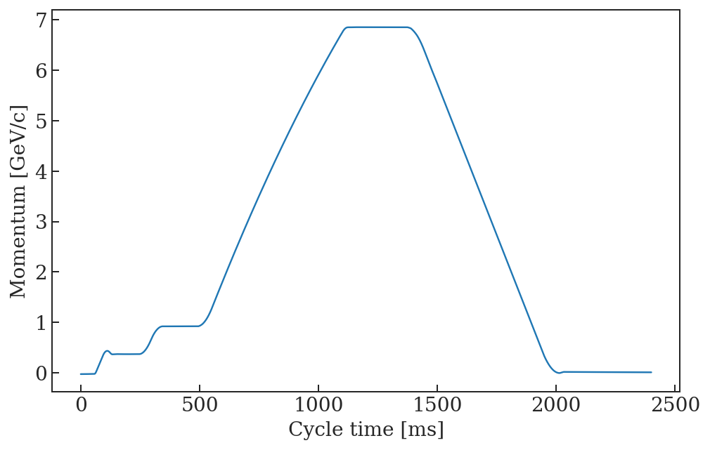


```python
f, ax = plt.subplots(1, figsize = (8,5))

ax.plot(t, ION.PR_W8L.LOG_OASIS_I_MEAS.value.DATA, label = 'W8L')
ax.plot(t, ION.PR_WDNP.LOG_OASIS_I_MEAS.value.DATA, label = 'WD')
ax.plot(t, ION.PR_WFNP.LOG_OASIS_I_MEAS.value.DATA, label = 'WF')
# ax.plot(t, EAST.PR_WDW.LOG_OASIS_I_MEAS.value.DATA, label = 'WDW')
# ax.plot(t, EAST.PR_WFW.LOG_OASIS_I_MEAS.value.DATA, label = 'WFW')

ax2 = ax.twinx()
ax2.plot(t, p, 'k')
ax2.set_ylim(0, 7)

ax.set_xlabel('Cycle time [ms]')
ax.set_ylabel('Current [A]')
ax2.set_ylabel('Momentum [GeV/c]')
ax.legend(frameon = False, loc = 'upper left')

ax.set_xlim(160, 1600)
```


    (160, 1600)


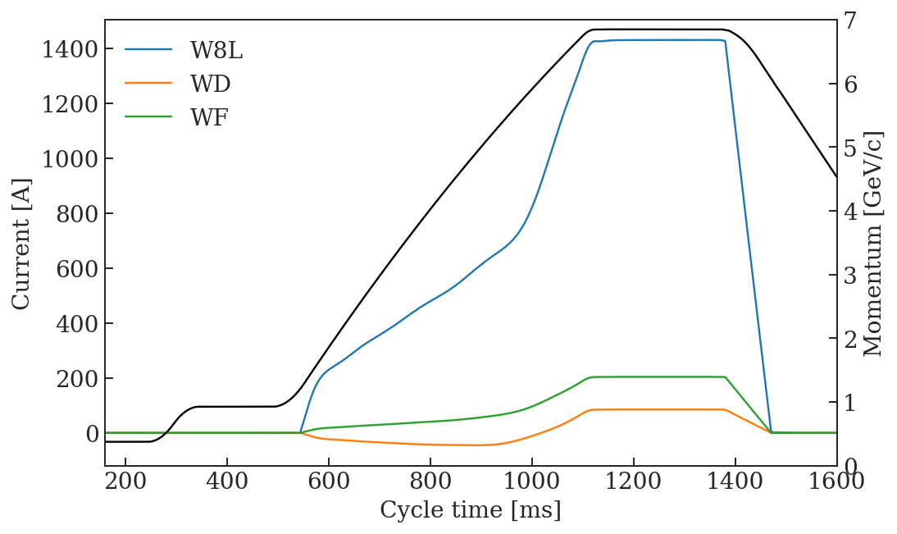


# MD cycle for chroma measurements at flat bottom


```python
IONMD = myToolbox.japcMatlabImport('./measurement_data/ION/injection_energy/2018.12.07.10.33.06.450.mat')
```


```python
ts1 = datetime.datetime(2018, 12, 7, 11)
ts2 = datetime.datetime(2018, 12, 7, 12)
[f for f in log.getFundamentals(log.toTimestamp(ts1), log.toTimestamp(ts2), 'CPS%')]
```


    [u'CPS:ILHC#1B_PB_NEWTRANSITION:MD7',
     u'CPS:ILHC100#4B_PB_FINEMETTEST:LHC1',
     u'CPS:IONLIFETIME:ION2',
     u'CPS:~~ZERO~~:ZERO']


```python
f, ax = plt.subplots(1, figsize = (8,5))

t = np.arange(IONMD.PR_BMEAS_B_SD.Samples.value.firstSampleTime, 2400., 0.1)
B = IONMD.PR_BMEAS_B_SD.Samples.value.samples 
plt.plot(t, B)

ax.set_xlabel('Cycle time [ms]')
ax.set_ylabel('Magnetic field [G]')
```


    Text(0,0.5,'Magnetic field [G]')


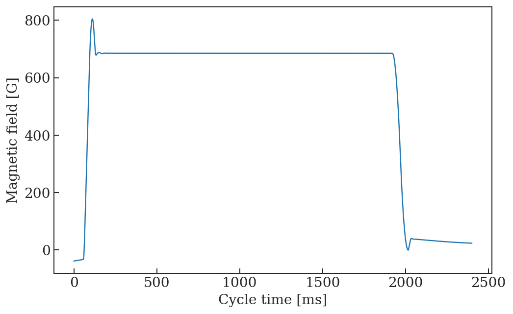


# Chromaticity measurements

These measurements have been performed 07.12.2018. Below are screenshots of the entries in the reference logbook.  

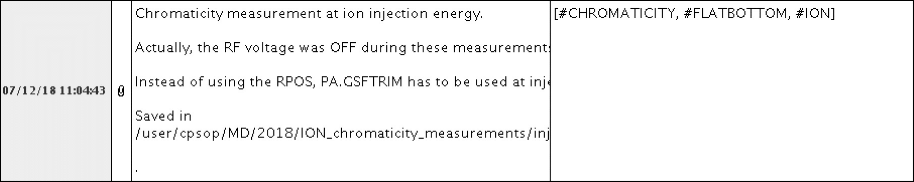

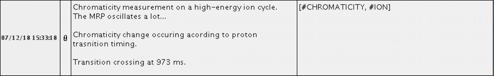

## Flat bottom


```python
file_ = './measurement_data/ION/injection_energy/07.12.2018_RF_ON/flat_bottom_chromaticity.csv'
Qxdp, Qx, Qydp, Qy = myToolbox.import_chromaticity(file_)
```


```python
NUM_COLORS = len(Qx)

cm = plt.get_cmap('Reds')

f, ax = plt.subplots(1, figsize = (8,5))

for i, c in enumerate(Qx.columns[2:]):
    col = cm(1.*i/len(Qx))
    ax.plot(Qxdp[c]*1e3, Qx[c], '-o', color = col)

cm = plt.get_cmap('Blues')
for i, c in enumerate(Qy.columns[2:]):
    col = cm(1.*i/len(Qx))
    ax.plot(Qydp[c]*1e3, Qy[c], '-o', color = col)
    
ax.set_xlabel('dp/p [$10^{-3}$]')
ax.set_ylabel('Tune')
ax.set_xlim(-2.5, 6)
```


    (-2.5, 6)


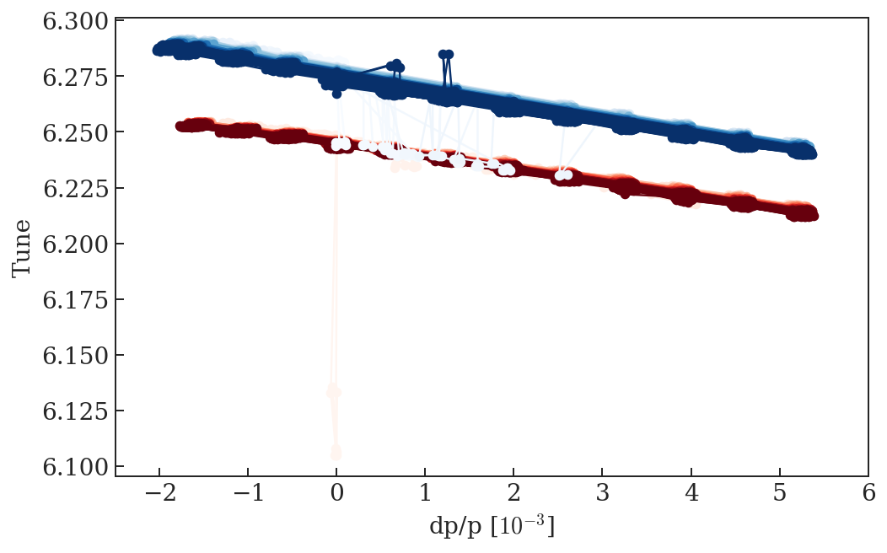


```python
# Linear fit at low energy, quadratic from transition on
Qx_fit = myToolbox.fit_chromaticity(Qxdp, Qx, 2)
Qy_fit = myToolbox.fit_chromaticity(Qydp, Qy, 2)
```


```python
f, ax = plt.subplots(1, figsize = (8,5))

ax.plot(Qx_fit['time'], Qx_fit['tune'], '-o', color = 'firebrick', label = '$Q_x$')

ax.plot(Qy_fit['time'], Qy_fit['tune'], '-o', color = 'royalblue', label = '$Q_y$')

ax2 = ax.twinx()
ax2.plot(t, B, 'k')
# ax2.set_ylim(0, 7)

ax.set_xlabel('Cycle time [ms]')
ax.set_ylabel('Tune')
ax2.set_ylabel('Magnetic field [G]')
ax.legend(frameon = False, loc = 'lower right')

ax.set_xlim(350, 1500)
```


    (350, 1500)


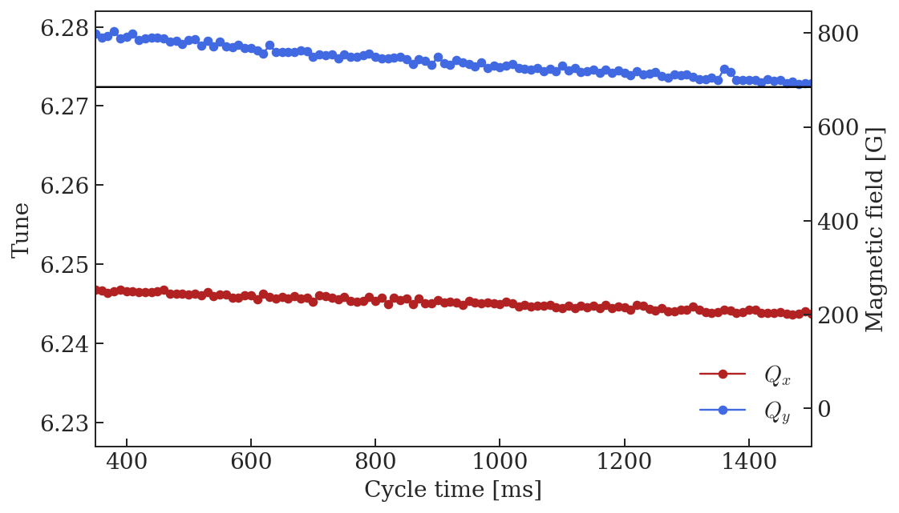


```python
f, ax = plt.subplots(1, figsize = (8,5))

ax.plot(Qx_fit['time'], Qx_fit['chromaticity'], '-o', color = 'firebrick', label = '$Q_x^\prime$')

ax.plot(Qy_fit['time'], Qy_fit['chromaticity'], '-o', color = 'royalblue', label = '$Q_y^\prime$')

ax2 = ax.twinx()
ax2.plot(t, B, 'k')
# ax2.set_ylim(0, 7)

ax.set_xlabel('Cycle time [ms]')
ax.set_ylabel('Chromaticity')
ax2.set_ylabel('Magnetic field [G]')
ax.legend(frameon = False, loc = 'upper right')

ax.set_xlim(350, 1500)
ax.set_ylim(-10, 5)
```


    (-10, 5)


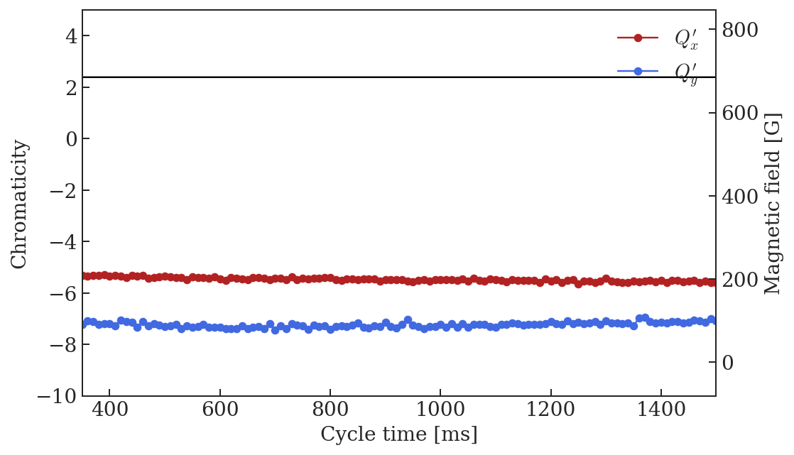


```python
f, ax = plt.subplots(1, figsize = (8,5))

ax.plot(Qx_fit['time'], Qx_fit['nl_chromaticity'], '-o', color = 'firebrick', label = '$Q_x^{\prime\prime}$')

ax.plot(Qy_fit['time'], Qy_fit['nl_chromaticity'], '-o', color = 'royalblue', label = '$Q_y^{\prime\prime}$')

ax2 = ax.twinx()
ax2.plot(t, B, 'k')
# ax2.set_ylim(0, 7)

ax.set_xlabel('Cycle time [ms]')
ax.set_ylabel('Non-linear chromaticity')
ax2.set_ylabel('Magnetic field [G]')
ax.legend(frameon = False, loc = 'lower right')

ax.set_xlim(350, 1500)
ax.set_ylim(-500, 300)
```


    (-500, 300)


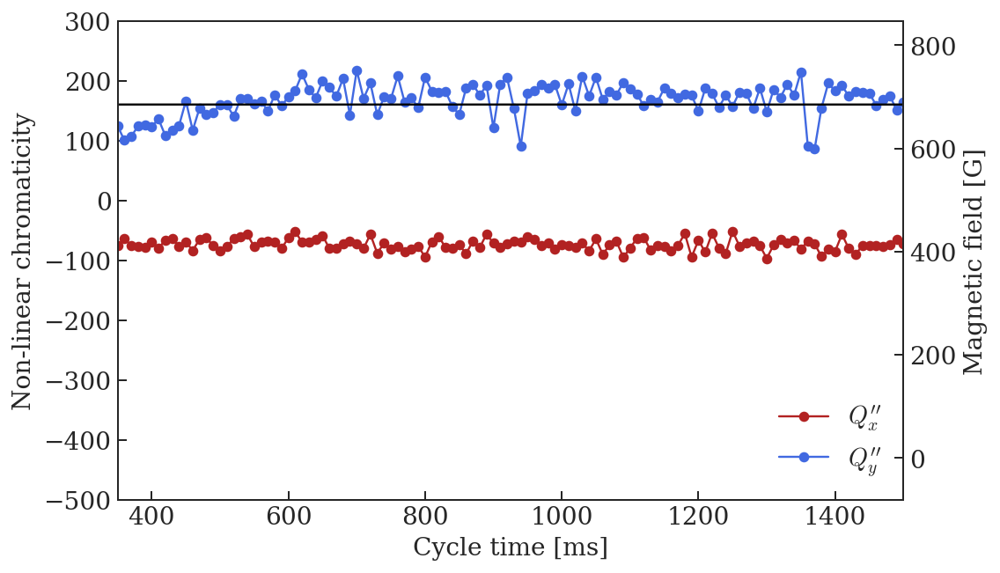


# High energy


```python
file_ = './measurement_data/ION/full_cycle/full_cycle_chromaticity.csv'
Qxdp, Qx, Qydp, Qy = myToolbox.import_chromaticity(file_)
```


```python
NUM_COLORS = len(Qx)

cm = plt.get_cmap('Reds')

f, ax = plt.subplots(1, figsize = (8,5))

for i, c in enumerate(Qx.columns[2:]):
    col = cm(1.*i/len(Qx))
    ax.plot(Qxdp[c]*1e3, Qx[c], '-o', color = col)

cm = plt.get_cmap('Blues')
for i, c in enumerate(Qy.columns[2:]):
    col = cm(1.*i/len(Qx))
    ax.plot(Qydp[c]*1e3, Qy[c], '-o', color = col)
    
ax.set_xlabel('dp/p [$10^{-3}$]')
ax.set_ylabel('Tune')
ax.set_xlim(-10, 10)
```


    (-10, 10)


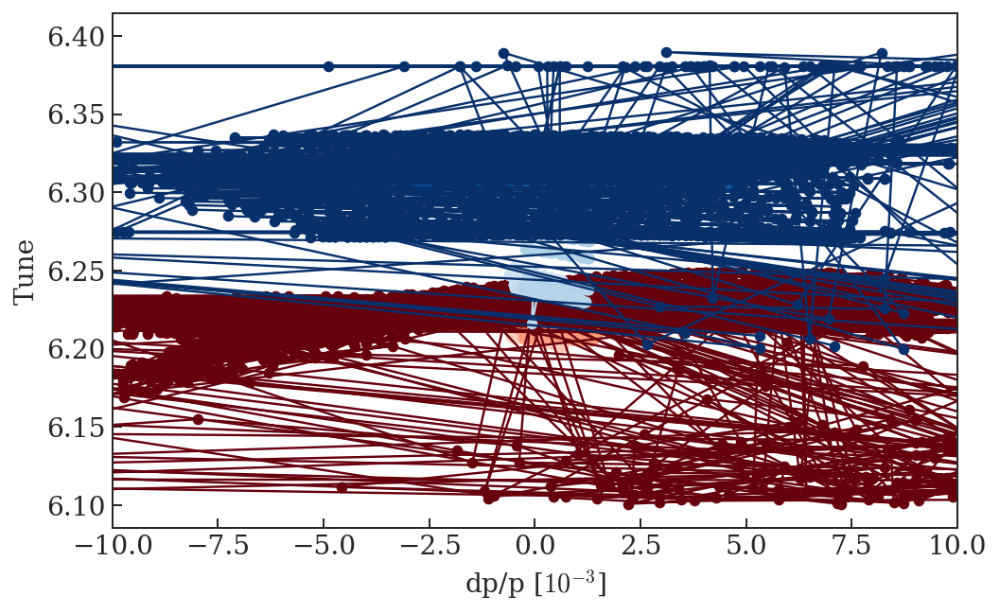


```python
# Linear fit at low energy, quadratic from transition on
Qx_fit = myToolbox.fit_chromaticity(Qxdp, Qx, 2)
Qy_fit = myToolbox.fit_chromaticity(Qydp, Qy, 2)
```


```python
f, ax = plt.subplots(1, figsize = (8,5))

ax.plot(Qx_fit['time'], Qx_fit['tune'], '-o', color = 'firebrick', label = '$Q_x$')

ax.plot(Qy_fit['time'], Qy_fit['tune'], '-o', color = 'royalblue', label = '$Q_y$')

ax2 = ax.twinx()
ax2.plot(t, p, 'k')
# ax2.set_ylim(0, 7)

ax.set_xlabel('Cycle time [ms]')
ax.set_ylabel('Tune')
ax2.set_ylabel('Magnetic field [G]')
ax.legend(frameon = False, loc = 'upper left')

ax.set_xlim(350, 1500)
```


    (350, 1500)


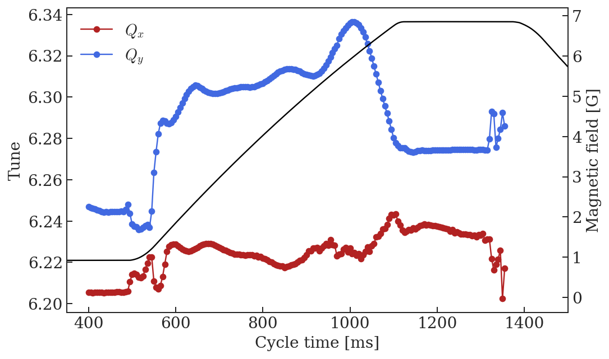


```python
f, ax = plt.subplots(1, figsize = (8,5))

ax.plot(Qx_fit['time'], Qx_fit['chromaticity'], '-o', color = 'firebrick', label = '$Q_x^\prime$')

ax.plot(Qy_fit['time'], Qy_fit['chromaticity'], '-o', color = 'royalblue', label = '$Q_y^\prime$')

ax2 = ax.twinx()
ax2.plot(t, p, 'k')
# ax2.set_ylim(0, 7)

ax.set_xlabel('Cycle time [ms]')
ax.set_ylabel('Chromaticity')
ax2.set_ylabel('Magnetic field [G]')
ax.legend(frameon = False, loc = 'upper left')

ax.set_xlim(350, 1500)
ax.set_ylim(-10, 5)
```


    (-10, 5)


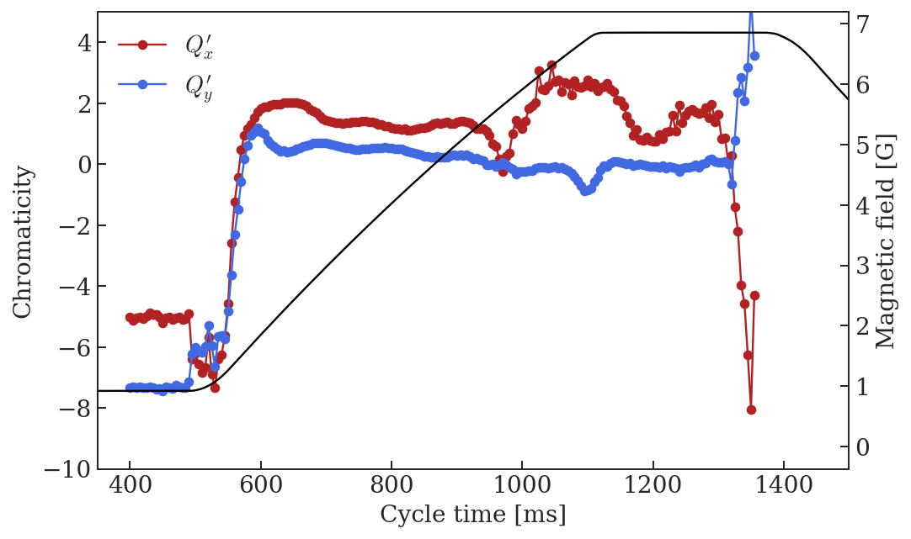


```python
f, ax = plt.subplots(1, figsize = (8,5))

ax.plot(Qx_fit['time'], Qx_fit['nl_chromaticity'], '-o', color = 'firebrick', label = '$Q_x^{\prime\prime}$')

ax.plot(Qy_fit['time'], Qy_fit['nl_chromaticity'], '-o', color = 'royalblue', label = '$Q_y^{\prime\prime}$')

ax2 = ax.twinx()
ax2.plot(t, p, 'k')
# ax2.set_ylim(0, 7)

ax.set_xlabel('Cycle time [ms]')
ax.set_ylabel('Non-linear chromaticity')
ax2.set_ylabel('Magnetic field [G]')
ax.legend(frameon = False, loc = 'lower right')

ax.set_xlim(350, 1500)
ax.set_ylim(-500, 300)
```


    (-500, 300)


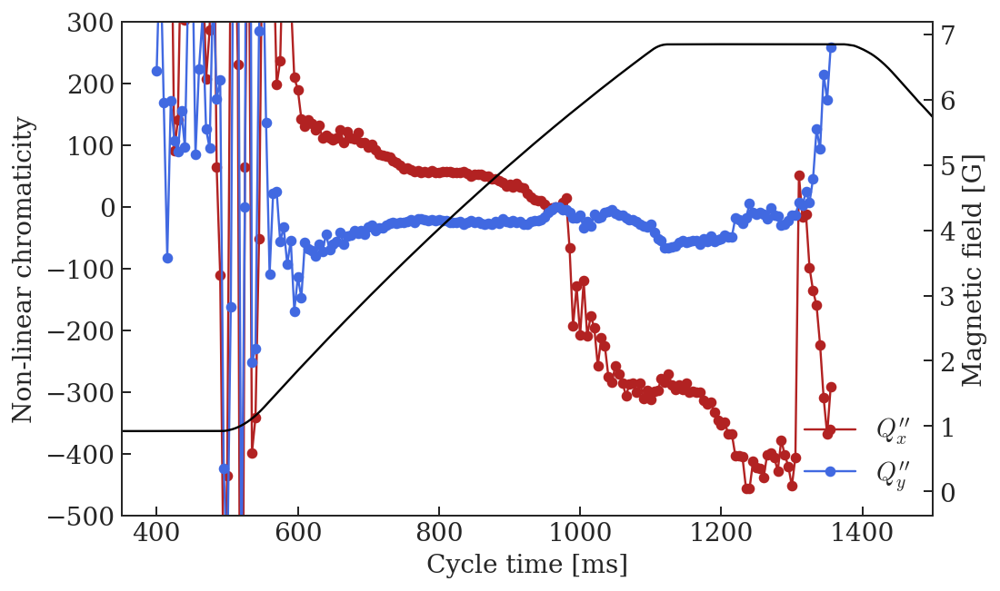


# Create MAD-X input

## Flat bottom


```python
print('Cycle time = ' + str(Qx_fit['time'].iloc[5]) + ' ms\n')

aux = Qx_fit['coefficients'].iloc[5]
print('! Qx = ' + str(np.round(aux[2]-6, 5)) + ' + ' + str(np.round(aux[1], 5)) + '*x + ' + str(np.round(aux[0], 5)) + '*x^2')
print('Qx := ' + str(np.round(aux[2]-6, 5)) + ';')
print('Qxp := ' + str(np.round(aux[1], 5)) + ';')
print('Qxp2 := ' + str(np.round(aux[0], 5)) + ';')

print('')

aux = Qy_fit['coefficients'].iloc[5]
print('! Qy = ' + str(np.round(aux[2]-6, 5)) + ' + ' + str(np.round(aux[1], 5)) + '*x + ' + str(np.round(aux[0], 5)) + '*x^2')
print('Qy := ' + str(np.round(aux[2]-6, 5)) + ';')
print('Qyp := ' + str(np.round(aux[1], 5)) + ';')
print('Qyp2 := ' + str(np.round(aux[0], 5)) + ';')
```

    Cycle time = 350.0 ms
    
    ! Qx = 0.24674 + -5.33099*x + -75.67066*x^2
    Qx := 0.24674;
    Qxp := -5.33099;
    Qxp2 := -75.67066;
    
    ! Qy = 0.27913 + -7.22147*x + 125.01952*x^2
    Qy := 0.27913;
    Qyp := -7.22147;
    Qyp2 := 125.01952;


## Flat top


```python
print('Cycle time = ' + str(Qx_fit['time'].iloc[157]) + ' ms\n')
print('Cycle time = ' + str(Qy_fit['time'].iloc[160]) + ' ms\n')

aux = Qx_fit['coefficients'].iloc[157]
print('! Qx = ' + str(np.round(aux[2]-6, 5)) + ' + ' + str(np.round(aux[1], 5)) + '*x + ' + str(np.round(aux[0], 5)) + '*x^2')
print('Qx := ' + str(np.round(aux[2]-6, 5)) + ';')
print('Qxp := ' + str(np.round(aux[1], 5)) + ';')
print('Qxp2 := ' + str(np.round(aux[0], 5)) + ';')

print('')

aux = Qy_fit['coefficients'].iloc[160]
print('! Qy = ' + str(np.round(aux[2]-6, 5)) + ' + ' + str(np.round(aux[1], 5)) + '*x + ' + str(np.round(aux[0], 5)) + '*x^2')
print('Qy := ' + str(np.round(aux[2]-6, 5)) + ';')
print('Qyp := ' + str(np.round(aux[1], 5)) + ';')
print('Qyp2 := ' + str(np.round(aux[0], 5)) + ';')
```

    Cycle time = 1185.0 ms
    
    Cycle time = 1200.0 ms
    
    ! Qx = 0.23802 + 0.78214*x + -317.07576*x^2
    Qx := 0.23802;
    Qxp := 0.78214;
    Qxp2 := -317.07576;
    
    ! Qy = 0.27424 + -0.07398*x + -52.17227*x^2
    Qy := 0.27424;
    Qyp := -0.07398;
    Qyp2 := -52.17227;


# Comparison between MAD-X output and measurements

## Flat bottom


```python
mad = metaclass.twiss('/eos/user/a/ahuschau/www/test-acc-models/repository/PS/2019/scenarios/Bare_machine/1_ion_injection_energy/PS_ION_bare_machine_chromaticity_summary.out')

f, ax = plt.subplots(1,2, figsize = (16, 5))

p = np.poly1d(Qx_fit['coefficients'].iloc[5])
dp = np.linspace(-0.003, 0.006, 100)
ax[0].plot(dp*1e3, p(dp), 'k', label = 'data fit')
ax[0].plot(mad.DP0*1e3, mad.QX+6, 'or', label = 'MAD-X result')
ax[0].legend(frameon = False)

p = np.poly1d(Qy_fit['coefficients'].iloc[5])
dp = np.linspace(-0.003, 0.006, 100)
ax[1].plot(dp*1e3, p(dp), 'k')
ax[1].plot(mad.DP0*1e3, mad.QY+6, 'or')

ylabel = ['$Q_x$', '$Q_y$']
for i in xrange(2):
    ax[i].set_xlabel('dp/p [$10^{-3}$]')
    ax[i].set_ylabel(ylabel[i])
```

    alllabels 4


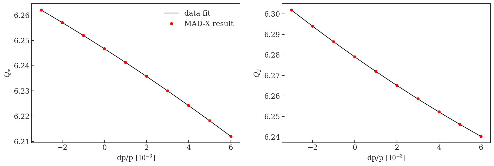


# Flat top


```python
mad = metaclass.twiss('/eos/user/a/ahuschau/www/test-acc-models/repository/PS/2019/scenarios/LHC_ION/2_flat_top/PS_FT_ION_chromaticity_summary.out')

f, ax = plt.subplots(1,2, figsize = (16, 5))

p = np.poly1d(Qx_fit['coefficients'].iloc[157])
dp = np.linspace(-0.004, 0.008, 100)
ax[0].plot(dp*1e3, p(dp), 'k', label = 'data fit')
ax[0].plot(mad.DP0*1e3, mad.QX+6, 'or', label = 'MAD-X result')
ax[0].legend(frameon = False)

p = np.poly1d(Qy_fit['coefficients'].iloc[160])
dp = np.linspace(-0.004, 0.008, 100)
ax[1].plot(dp*1e3, p(dp), 'k')
ax[1].plot(mad.DP0*1e3, mad.QY+6, 'or')

ylabel = ['$Q_x$', '$Q_y$']
for i in xrange(2):
    ax[i].set_xlabel('dp/p [$10^{-3}$]')
    ax[i].set_ylabel(ylabel[i])
```

    alllabels 4


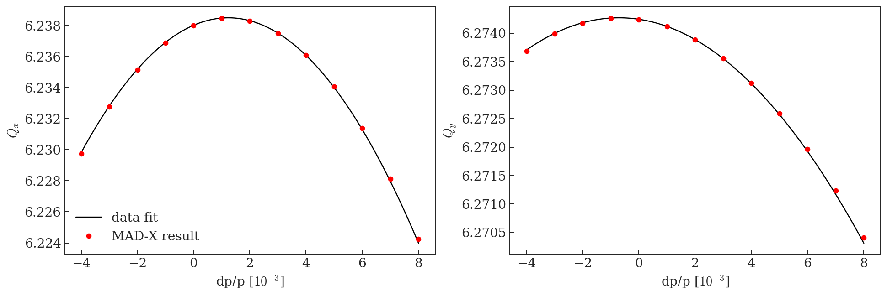


```python
!jupyter nbconvert --to markdown --output-dir='../test-acc-models/repository/PS/2019/scenarios/LHC_ION/' ION_chromaticity_measurement.ipynb
```
