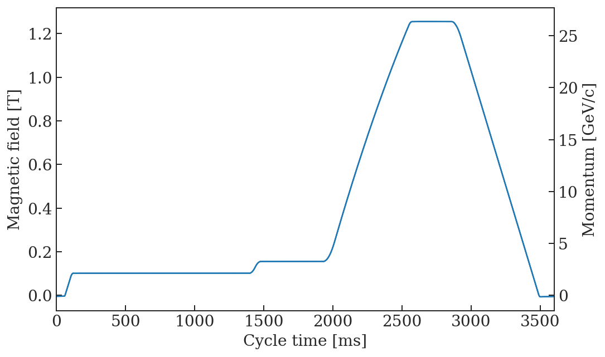
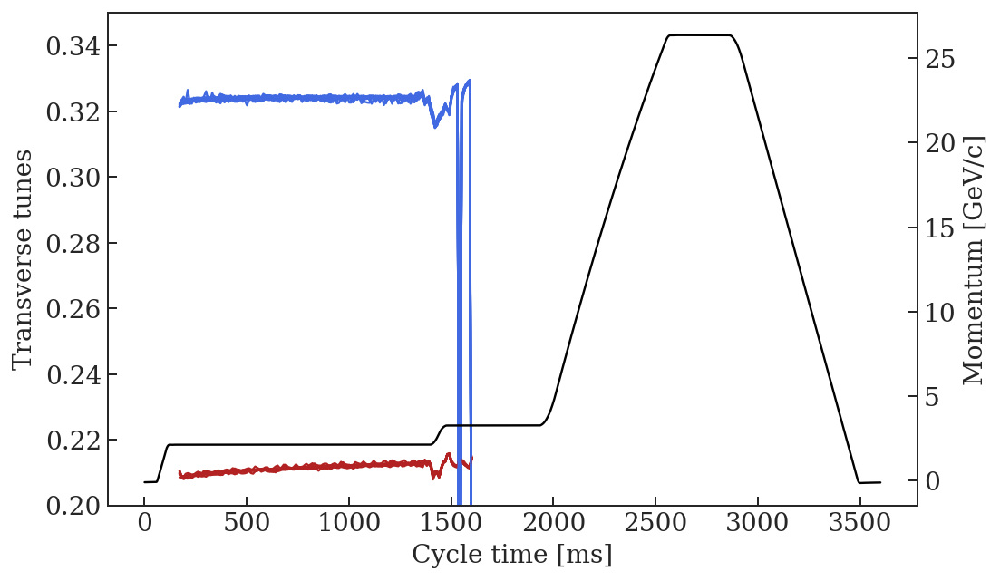
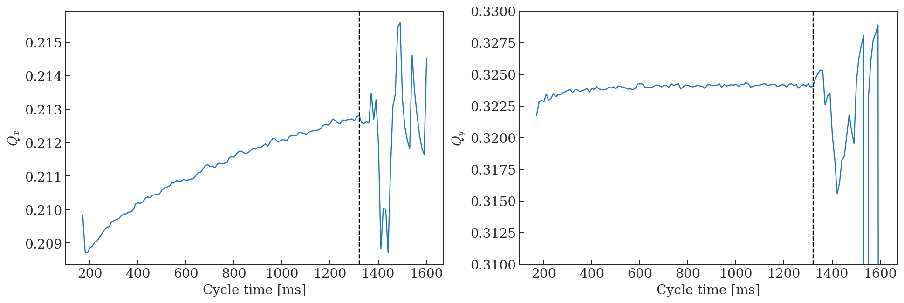
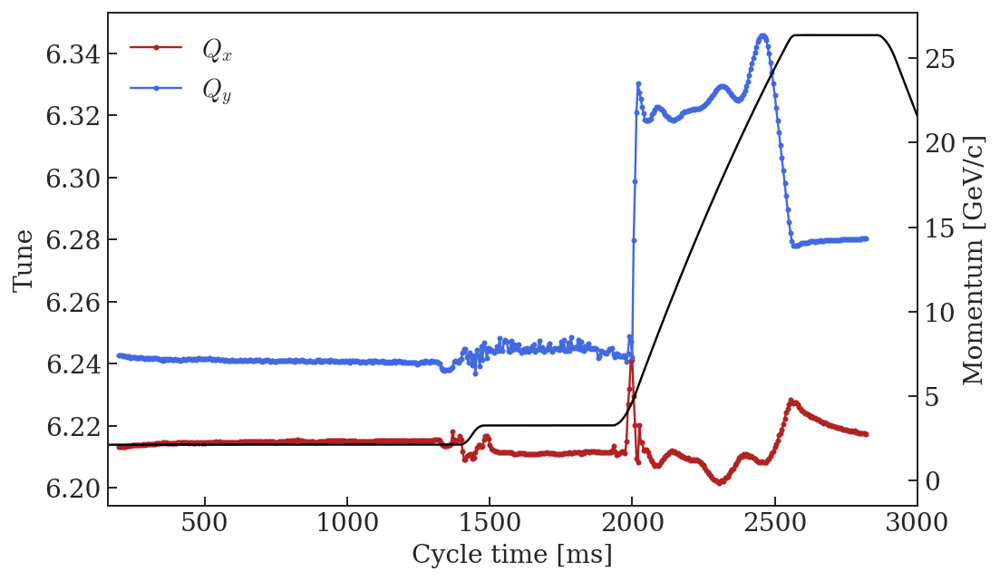
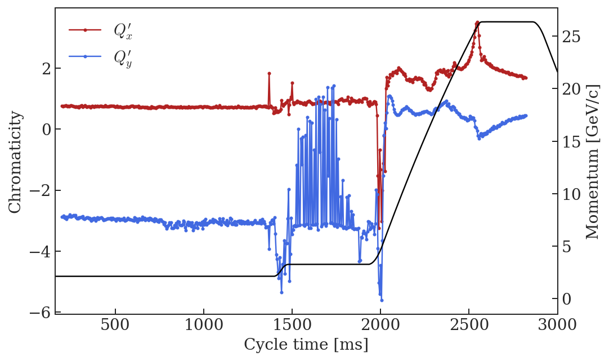
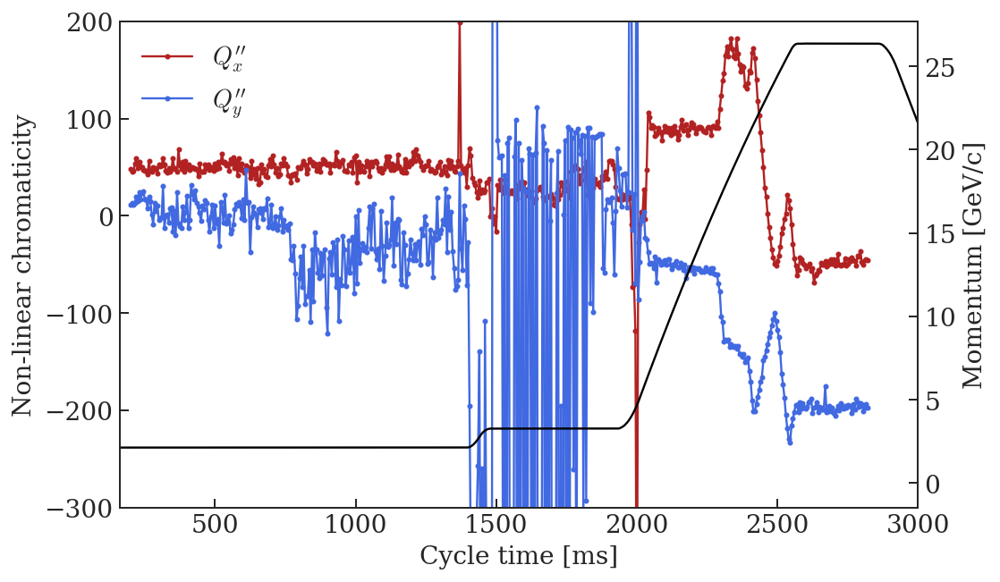
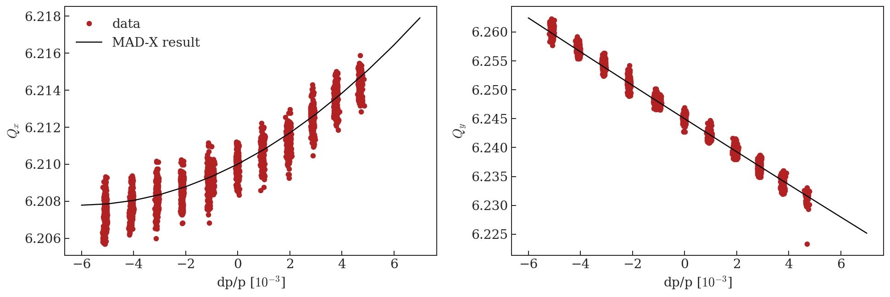
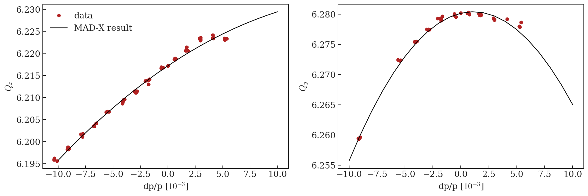

# BCMS chromaticity measurements


```python
%run /eos/project/l/liu/Toolbox/myToolbox.py

%config InlineBackend.figure_format = 'retina'

plt.rcParams["mathtext.fontset"] = "cm"
```

    Version 0.03. This is the latest version.
    Please help me to improve it reporting bugs to guido.sterbini@cern.ch.


    /eos/project/l/liu/Toolbox/myToolbox.py:24: FutureWarning: 'pandas.tseries.converter.register' has been moved and renamed to 'pandas.plotting.register_matplotlib_converters'. 
      converter.register()


    Your platform is Linux-3.10.0-957.21.3.el7.x86_64-x86_64-with-centos-7.6.1810-Core
    Your folder is /eos/user/a/ahuschau/www/chromaticity_measurements
    Your IP is 172.17.0.18
    2019-07-22 14:18:29


# LHC magnetic cylce


```python
LHC = myToolbox.japcMatlabImport('./measurement_data/bare_machine/2018.11.01.16.29.29.097.mat')
```


```python
f, ax = plt.subplots(1, figsize = (8,5))

t = np.arange(LHC.PR_BMEAS_B_SD.Samples.value.firstSampleTime, len(LHC.PR_BMEAS_B_SD.Samples.value.samples)*LHC.PR_BMEAS_B_SD.Samples.value.samplingTrain, LHC.PR_BMEAS_B_SD.Samples.value.samplingTrain)
B = LHC.PR_BMEAS_B_SD.Samples.value.samples/1e4
p = LHC.PR_MOMENTUM_ST.Samples.value.samples/1e3
ax.plot(t, B)

ax.set_xlabel('Cycle time [ms]')
ax.set_ylabel('Magnetic field [T]')
ax.set_xlim(0, 3600)

ax2 = ax.twinx()
ax2.plot(t, p)
ax2.set_ylabel('Momentum [GeV/c]')
```


    Text(0,0.5,'Momentum [GeV/c]')





# Tune measurement without LEQ

In order to perform proper matching, the effect of the PFW on the working point is important to know. Therefore, and in addition to the chromaticity measurements analysed below in the next section, a tune measurement without the LEQ was done on the flat bottom to know the tune change caused by the PFW. The average value of all performed measurements and furthermore the average from injection to 1300 ms is considered.


```python
folder = '/eos/project/l/liu/PS/data/2018/MD4511_matrix_measurement/2018.11.06_BCMS_tune_with_PFW_no_LEQ/without_LEQ_ZERO_in_front/'
files = sorted(glob.glob(folder + '*.mat'))

tunes = myToolbox.fromMatlabToDataFrame(files[1:], ['PR_BQL72.SamplerAcquisition.value.estimatedTuneH', 'PR_BQL72.SamplerAcquisition.value.estimatedTuneV'])

aux = myToolbox.japcMatlabImport(files[0])
period  = aux.PR_BQS72.SamplerAcquisition.value.acqPeriod
offset = aux.PR_BQS72.SamplerAcquisition.value.acqOffset
samples = aux.PR_BQS72.SamplerAcquisition.value.estimatedTuneH

t_Q = np.arange(offset, len(samples)*period, period) + 170
```


```python
f,ax = plt.subplots(1,figsize = (8,5))

for i in xrange(len(tunes)):
    ax.plot(t_Q, tunes['PR_BQL72.SamplerAcquisition.value.estimatedTuneH'].iloc[i], color = 'firebrick',)
    ax.plot(t_Q, tunes['PR_BQL72.SamplerAcquisition.value.estimatedTuneV'].iloc[i], color = 'royalblue',)
    
# plt.xlim(170, 1000)
plt.ylim(0.2, 0.35)

ax.set_xlabel('Cycle time [ms]')
ax.set_ylabel('Transverse tunes')

ax2 = ax.twinx()
ax2.plot(t, p, 'k')
ax2.set_ylabel('Momentum [GeV/c]')
```


    Text(0,0.5,'Momentum [GeV/c]')





```python
f,ax = plt.subplots(1,2, figsize = (16,5))

ax[0].plot(t_Q, np.mean(tunes['PR_BQL72.SamplerAcquisition.value.estimatedTuneH']))
ax[0].axvline(t_Q[115], linestyle = '--', color = 'k')
ax[0].set_xlabel('Cycle time [ms]')
ax[0].set_ylabel('$Q_x$')

ax[1].plot(t_Q, np.mean(tunes['PR_BQL72.SamplerAcquisition.value.estimatedTuneV']))
ax[1].axvline(t_Q[115], linestyle = '--', color = 'k')
plt.ylim(0.31, 0.33)
ax[1].set_xlabel('Cycle time [ms]')
ax[1].set_ylabel('$Q_y$')

```


    Text(0,0.5,'$Q_y$')





```python
Qx = np.mean(tunes['PR_BQL72.SamplerAcquisition.value.estimatedTuneH'])
Qy = np.mean(tunes['PR_BQL72.SamplerAcquisition.value.estimatedTuneV'])

Qx_PFW = np.mean(Qx[1:115])
Qy_PFW = np.mean(Qy[1:115])

print('!Mean tune values:')
print('Qx = ' + str(np.round(Qx_PFW, 3)))
print('Qy = ' + str(np.round(Qy_PFW, 3)))
```

    !Mean tune values:
    Qx = 0.211
    Qy = 0.324


# Chromaticity measurement

These measurements have been performed on 01.11.2018. Below is a screenshot of the entry in the reference logbook. 


The cycle was set up in the following for these measurements:
- chromaticity was corrected with the PFW
- for the chromaticity measurements the LEQ were enabled, however
- another measurement without the LEQ was done to evaluate the "bare tune" with only PFW on

Therefore, the PTC matching should be done the following way:
- match the non-linear chromaticity according to the polynomials
- rematch the tunes with the LEQ to the operational values of Qx = 6.21, Qy = 6.245


```python
file_ = './measurement_data/BCMS/High_and_low_energy.csv'
Qxdp, Qx, Qydp, Qy = myToolbox.import_chromaticity(file_)
```


```python
Qx_fit = myToolbox.fit_chromaticity(Qxdp, Qx, 2)
Qy_fit = myToolbox.fit_chromaticity(Qydp, Qy, 2)
```


```python
f, ax = plt.subplots(1, figsize = (8,5))

ax.plot(Qx_fit['time'], Qx_fit['tune'], '-o', color = 'firebrick', label = '$Q_x$', ms=2)
ax.plot(Qy_fit['time'], Qy_fit['tune'], '-o', color = 'royalblue', label = '$Q_y$', ms=2)

ax.set_xlabel('Cycle time [ms]')
ax.set_ylabel('Tune')
ax.legend(frameon = False, loc = 'upper left')
ax.set_xlim(160, 3000)

ax2 = ax.twinx()
ax2.plot(t, p, 'k')
ax2.set_ylabel('Momentum [GeV/c]')
```


    Text(0,0.5,'Momentum [GeV/c]')





```python
f, ax = plt.subplots(1, figsize = (8,5))

ax.plot(Qx_fit['time'], Qx_fit['chromaticity'], '-o', color = 'firebrick', label = '$Q_x^\prime$', ms=2)
ax.plot(Qy_fit['time'], Qy_fit['chromaticity'], '-o', color = 'royalblue', label = '$Q_y^\prime$', ms=2)

ax.set_xlabel('Cycle time [ms]')
ax.set_ylabel('Chromaticity')
ax.legend(frameon = False)
ax.set_xlim(160, 3000)

ax2 = ax.twinx()
ax2.plot(t, p, 'k')
ax2.set_ylabel('Momentum [GeV/c]')
```


    Text(0,0.5,'Momentum [GeV/c]')





```python
f, ax = plt.subplots(1, figsize = (8,5))

ax.plot(Qx_fit['time'], Qx_fit['nl_chromaticity'], '-o', color = 'firebrick', label = '$Q_x^{\prime\prime}$', ms=2)
ax.plot(Qy_fit['time'], Qy_fit['nl_chromaticity'], '-o', color = 'royalblue', label = '$Q_y^{\prime\prime}$', ms=2)

ax.set_xlabel('Cycle time [ms]')
ax.set_ylabel('Non-linear chromaticity')
ax.legend(frameon = False, loc = 'upper left')
ax.set_xlim(160, 3000)
ax.set_ylim(-300, 200)

ax2 = ax.twinx()
ax2.plot(t, p, 'k')
ax2.set_ylabel('Momentum [GeV/c]')
```


    Text(0,0.5,'Momentum [GeV/c]')





# Create MAD-X input

## Flat bottom

### With PFW only


```python
print('Considering an average over the following time period: ' + str(Qx_fit['time'].iloc[0]) + ' ms - ' + str(Qx_fit['time'].iloc[100]) + ' ms') 

print('')

aux = Qx_fit['coefficients'].iloc[0:101]
print('! Qx = ' + str(np.round(Qx_PFW, 5)) + ' + ' + str(np.round(aux.apply(lambda x: x[1]).mean(), 5)) + '*x + ' + str(np.round(aux.apply(lambda x: x[0]).mean(), 5)) + '*x^2')
print('Qx0 := ' + str(np.round(Qx_PFW, 5)) + ';')
print('Qx1 := ' + str(np.round(aux.apply(lambda x: x[1]).mean(), 5)) + ';')
print('Qx2 := ' + str(np.round(aux.apply(lambda x: x[0]).mean(), 5)) + ';')

print('')

aux = Qy_fit['coefficients'].iloc[0:101]
print('! Qy = ' + str(np.round(Qy_PFW, 5)) + ' + ' + str(np.round(aux.apply(lambda x: x[1]).mean(), 5)) + '*x + ' + str(np.round(aux.apply(lambda x: x[0]).mean(), 5)) + '*x^2')
print('Qy0 := ' + str(np.round(Qy_PFW, 5)) + ';')
print('Qy1 := ' + str(np.round(aux.apply(lambda x: x[1]).mean(), 5)) + ';')
print('Qy2 := ' + str(np.round(aux.apply(lambda x: x[0]).mean(), 5)) + ';')
```

    Considering an average over the following time period: 200.0 ms - 700.0 ms
    
    ! Qx = 0.21122 + 0.73706*x + 49.71225*x^2
    Qx0 := 0.21122;
    Qx1 := 0.73706;
    Qx2 := 49.71225;
    
    ! Qy = 0.32396 + -2.92869*x + 4.99208*x^2
    Qy0 := 0.32396;
    Qy1 := -2.92869;
    Qy2 := 4.99208;


### Tunes with LEQ


```python
print('! Tunes need to be subsequently matched to operational WP:')
print('Qx = ' + str(0.210) + ';')
print('Qy = ' + str(0.245) + ';')
```

    ! Tunes need to be subsequently matched to operational WP:
    Qx = 0.21
    Qy = 0.245


## Flat top (C2820)


```python
idx = -1
print('Considering the last measured point at ' + str(Qx_fit['time'].iloc[idx]) + ' ms.') 

print('')

aux = Qx_fit['coefficients'].iloc[idx]
print('! Qx = ' + str(np.round(aux[2]-6, 5)) + ' + ' + str(np.round(aux[1], 5)) + '*x + ' + str(np.round(aux[0], 5)) + '*x^2')
print('Qx0 := ' + str(np.round(aux[2]-6, 5)) + ';')
print('Qx1 := ' + str(np.round(aux[1], 5)) + ';')
print('Qx2 := ' + str(np.round(aux[0], 5)) + ';')

print('')

aux = Qy_fit['coefficients'].iloc[idx]
print('! Qy = ' + str(np.round(aux[2]-6, 5)) + ' + ' + str(np.round(aux[1], 5)) + '*x + ' + str(np.round(aux[0], 5)) + '*x^2')
print('Qy0 := ' + str(np.round(aux[2]-6, 5)) + ';')
print('Qy1 := ' + str(np.round(aux[1], 5)) + ';')
print('Qy2 := ' + str(np.round(aux[0], 5)) + ';')
```

    Considering the last measured point at 2820.0 ms.
    
    ! Qx = 0.21738 + 1.67446*x + -45.89528*x^2
    Qx0 := 0.21738;
    Qx1 := 1.67446;
    Qx2 := -45.89528;
    
    ! Qy = 0.28029 + 0.43986*x + -197.38281*x^2
    Qy0 := 0.28029;
    Qy1 := 0.43986;
    Qy2 := -197.38281;


# Comparison between MAD-X output and measurements

## Flat bottom


```python
print('Considering an average over the following time period: ' + str(Qx_fit['time'].iloc[0]) + ' ms - ' + str(Qx_fit['time'].iloc[100]) + ' ms') 

print('')

aux = Qx_fit['coefficients'].iloc[0:101]
print('Qx0 := ' + str(np.round(aux.apply(lambda x: x[2]).mean(), 5)) + ';')

print('')

aux = Qy_fit['coefficients'].iloc[0:101]
print('Qy0 := ' + str(np.round(aux.apply(lambda x: x[2]).mean(), 5)) + ';')
```

    Considering an average over the following time period: 200.0 ms - 700.0 ms
    
    Qx0 := 6.21439;
    
    Qy0 := 6.24144;


The data points plotted in the following correspond to a configuration using the PFW and the LEQ. However, the tunes were not set up correctly to 0.21, 0.245 as it should be operationally. Therefore, the data need to be shifted by the offset calculate in the following.


```python
dQx = 0.21 - .21439
dQy = 0.245 - .24144
```


```python
mad = metaclass.twiss('/eos/user/a/ahuschau/www/PS/2019/scenarios/LHC_PROTON/1_flat_bottom/PS_FB_LHC_chromaticity_summary.out')

f, ax = plt.subplots(1,2, figsize = (16, 5))

for c in Qx.columns[2:103]:
    ax[0].plot(Qxdp[c]*1e3, Qx[c] + dQx, 'o', color = 'firebrick', label = '__nolegend__')
ax[0].plot(Qxdp[c]*1e3, Qx[c] + dQx, 'o', color = 'firebrick', label = 'data')
ax[0].plot(mad.DP0*1e3, mad.QX+6, 'k-', label = 'MAD-X result')
ax[0].legend(frameon = False)

for c in Qy.columns[2:103]:
    ax[1].plot(Qydp[c]*1e3, Qy[c] + dQy, 'o', color = 'firebrick', label = '__nolegend__')
ax[1].plot(Qydp[c]*1e3, Qy[c] + dQy, 'o', color = 'firebrick', label = 'data')
ax[1].plot(mad.DP0*1e3, mad.QY+6, 'k-', label = 'MAD-X result')

ylabel = ['$Q_x$', '$Q_y$']
for i in xrange(2):
    ax[i].set_xlabel('dp/p [$10^{-3}$]')
    ax[i].set_ylabel(ylabel[i])

```

    alllabels 4





## Flat top


```python
mad = metaclass.twiss('/eos/user/a/ahuschau/www/PS/2019/scenarios/LHC_PROTON/2_flat_top/PS_FT_LHC_chromaticity_summary.out')

f, ax = plt.subplots(1,2, figsize = (16, 5))

for c in Qx.columns[-1:]:
    ax[0].plot(Qxdp[c]*1e3, Qx[c], 'o', color = 'firebrick', label = '__nolegend__')
ax[0].plot(Qxdp[c]*1e3, Qx[c], 'o', color = 'firebrick', label = 'data')
ax[0].plot(mad.DP0*1e3, mad.QX+6, 'k-', label = 'MAD-X result')
ax[0].legend(frameon = False)

for c in Qy.columns[-1:]:
    ax[1].plot(Qydp[c]*1e3, Qy[c], 'o', color = 'firebrick', label = '__nolegend__')
ax[1].plot(Qydp[c]*1e3, Qy[c], 'o', color = 'firebrick', label = 'data')
ax[1].plot(mad.DP0*1e3, mad.QY+6, 'k-', label = 'MAD-X result')

ylabel = ['$Q_x$', '$Q_y$']
for i in xrange(2):
    ax[i].set_xlabel('dp/p [$10^{-3}$]')
    ax[i].set_ylabel(ylabel[i])

```

    alllabels 4





```python
!jupyter nbconvert --to markdown --output-dir='../test-acc-models/repository/PS/2019/scenarios/LHC_PROTON/' BCMS_chromaticity_measurement.ipynb
```

    [NbConvertApp] Converting notebook BCMS_chromaticity_measurement.ipynb to markdown
    [NbConvertApp] Support files will be in BCMS_chromaticity_measurement_files/
    [NbConvertApp] Making directory ../test-acc-models/repository/PS/2019/scenarios/LHC_PROTON/BCMS_chromaticity_measurement_files
    [NbConvertApp] Making directory ../test-acc-models/repository/PS/2019/scenarios/LHC_PROTON/BCMS_chromaticity_measurement_files
    [NbConvertApp] Making directory ../test-acc-models/repository/PS/2019/scenarios/LHC_PROTON/BCMS_chromaticity_measurement_files
    [NbConvertApp] Making directory ../test-acc-models/repository/PS/2019/scenarios/LHC_PROTON/BCMS_chromaticity_measurement_files
    [NbConvertApp] Making directory ../test-acc-models/repository/PS/2019/scenarios/LHC_PROTON/BCMS_chromaticity_measurement_files
    [NbConvertApp] Making directory ../test-acc-models/repository/PS/2019/scenarios/LHC_PROTON/BCMS_chromaticity_measurement_files
    [NbConvertApp] Making directory ../test-acc-models/repository/PS/2019/scenarios/LHC_PROTON/BCMS_chromaticity_measurement_files
    [NbConvertApp] Making directory ../test-acc-models/repository/PS/2019/scenarios/LHC_PROTON/BCMS_chromaticity_measurement_files
    [NbConvertApp] Writing 14077 bytes to ../test-acc-models/repository/PS/2019/scenarios/LHC_PROTON/BCMS_chromaticity_measurement.md

