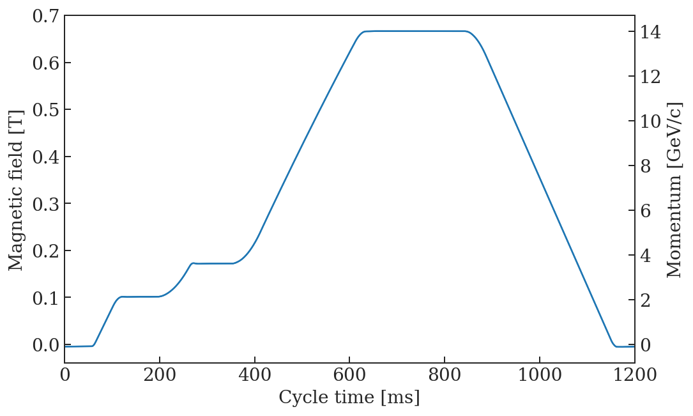
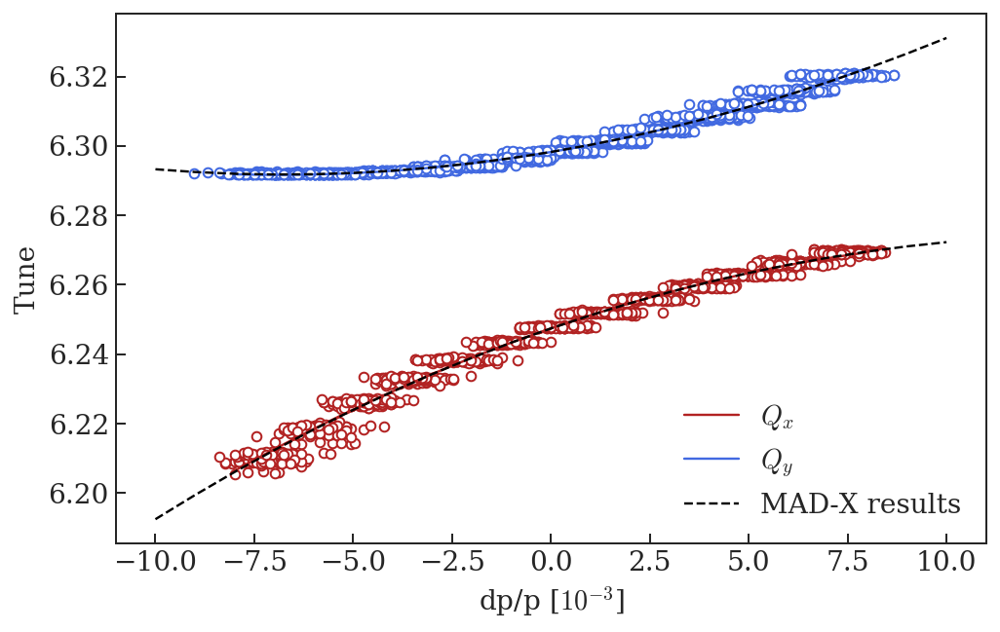

# SFTPRO chromaticity measurements


```python
%run /eos/project/l/liu/Toolbox/myToolbox.py

%config InlineBackend.figure_format = 'retina'

plt.rcParams["mathtext.fontset"] = "cm"

import csv
```

    Version 0.03. This is the latest version.
    Please help me to improve it reporting bugs to guido.sterbini@cern.ch.


    /eos/project/l/liu/Toolbox/myToolbox.py:24: FutureWarning: 'pandas.tseries.converter.register' has been moved and renamed to 'pandas.plotting.register_matplotlib_converters'. 
      converter.register()


    Your platform is Linux-3.10.0-957.21.3.el7.x86_64-x86_64-with-centos-7.6.1810-Core
    Your folder is /eos/user/a/ahuschau/www/chromaticity_measurements
    Your IP is 172.17.0.15
    2019-08-13 16:28:35


# SFTPRO magnetic cycle

Chromaticity measurements were most probably performed on 03.08.2015. The measurements were taken without any non-linear elements except the PFW. The magnetic cycle has not changed since 2015, therefore a more recent example is plotted below. 


```python
SFTPRO = myToolbox.japcMatlabImport('./measurement_data/MTE/2018.11.05.18.47.46.574.mat')
```


```python
f, ax = plt.subplots(1, figsize = (8,5))

t = np.arange(SFTPRO.PR_BMEAS_B_SD.Samples.value.firstSampleTime, len(SFTPRO.PR_BMEAS_B_SD.Samples.value.samples)*SFTPRO.PR_BMEAS_B_SD.Samples.value.samplingTrain, SFTPRO.PR_BMEAS_B_SD.Samples.value.samplingTrain)
B = SFTPRO.PR_BMEAS_B_SD.Samples.value.samples/1e4
rho = 70.07
p = 1/3.3356 * B * rho 
ax.plot(t, B)

ax2 = ax.twinx()
ax2.plot(t, p)

ax2.set_ylabel('Momentum [GeV/c]')
ax.set_xlabel('Cycle time [ms]')
ax.set_ylabel('Magnetic field [T]')

ax.set_xlim(0, 1200)
```


    (0, 1200)





# Chromaticity measurement at flat top


```python
file_ = './measurement_data/MTE/MTE_chromaticity.mat'
data = scipy.io.loadmat(file_, squeeze_me = True, struct_as_record = False)
```


```python
Qx_coeffs = np.polyfit(np.ndarray.flatten(data['dpH']), np.ndarray.flatten(data['QH']), 2)
Qy_coeffs = np.polyfit(np.ndarray.flatten(data['dpV']), np.ndarray.flatten(data['QV']), 2)
```


```python
madx = metaclass.twiss('../test-acc-models/repository/PS/2019/scenarios/SFTPRO/2_flat_top/PS_FT_SFTPRO_chromaticity_summary.out')

f, ax = plt.subplots(1, figsize = (8,5))

plt.plot(data['dpH']*1e3, data['QH'], 'o', color = 'firebrick', markerfacecolor = 'w', label = '__nolegend__')
p = np.poly1d(Qx_coeffs)
dp = np.linspace(-0.008, 0.008, 100)
ax.plot(dp*1e3, p(dp), 'firebrick', label = '$Q_x$')

plt.plot(data['dpV']*1e3, data['QV'], 'or', color = 'royalblue', markerfacecolor = 'w', label = '__nolegend__')
p = np.poly1d(Qy_coeffs)
ax.plot(dp*1e3, p(dp), 'royalblue', label = '$Q_y$')

ax.plot(madx.DP0*1e3, madx.QX+6, '--k', label = 'MAD-X results')
ax.plot(madx.DP0*1e3, madx.QY+6, '--k')

ax.set_xlabel('dp/p [$10^{-3}$]')
ax.set_ylabel('Tune')
ax.legend(frameon = False)
```

    alllabels 4


    <matplotlib.legend.Legend at 0x7f7503fdee50>





# Create MAD-X input


```python
aux = Qx_coeffs
print('! Qx = ' + str(np.round(aux[2]-6, 5)) + ' + ' + str(np.round(aux[1], 5)) + '*x + ' + str(np.round(aux[0], 5)) + '*x^2')
print('Qx0 := ' + str(np.round(aux[2]-6, 5)) + ';')
print('Qx1 := ' + str(np.round(aux[1], 5)) + ';')
print('Qx2 := ' + str(np.round(aux[0], 5)) + ';')

print('')

aux = Qy_coeffs
print('! Qy = ' + str(np.round(aux[2]-6, 5)) + ' + ' + str(np.round(aux[1], 5)) + '*x + ' + str(np.round(aux[0], 5)) + '*x^2')
print('Qy0 := ' + str(np.round(aux[2]-6, 5)) + ';')
print('Qy1 := ' + str(np.round(aux[1], 5)) + ';')
print('Qy2 := ' + str(np.round(aux[0], 5)) + ';')
```

    ! Qx = 0.24741 + 3.93418*x + -149.25316*x^2
    Qx0 := 0.24741;
    Qx1 := 3.93418;
    Qx2 := -149.25316;
    
    ! Qy = 0.29826 + 1.91171*x + 138.43789*x^2
    Qy0 := 0.29826;
    Qy1 := 1.91171;
    Qy2 := 138.43789;


```python
!jupyter nbconvert --to markdown --output-dir='../test-acc-models/repository/PS/2019/scenarios/SFTPRO/' MTE_chromaticity_measurement.ipynb
```
