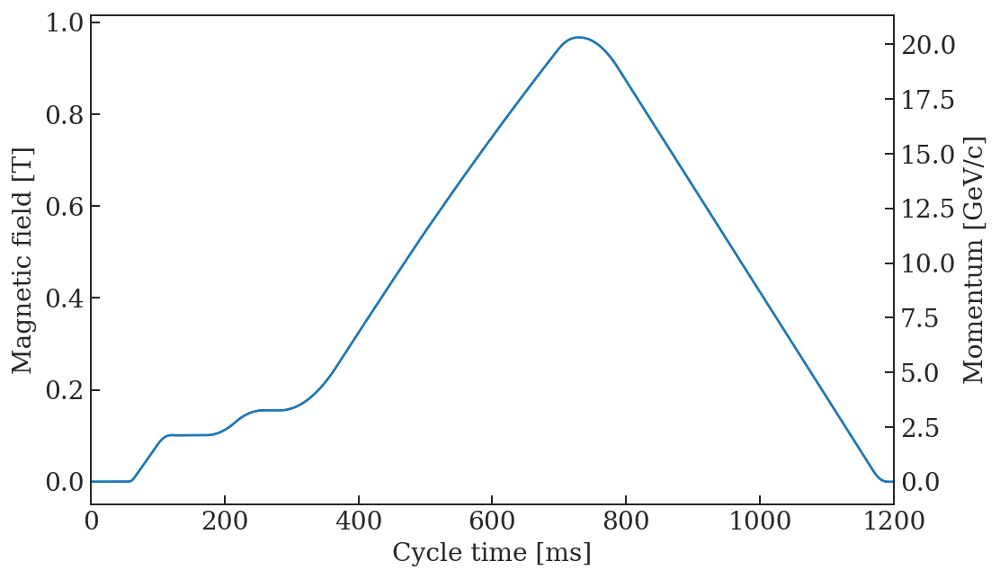
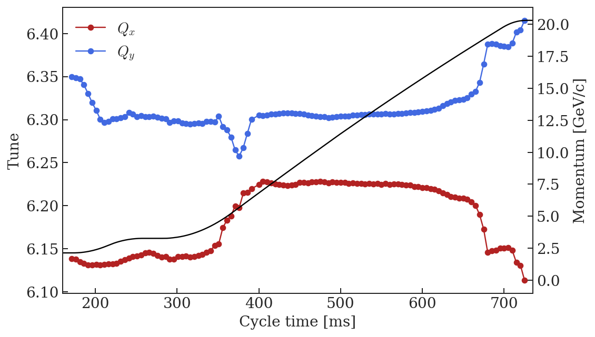
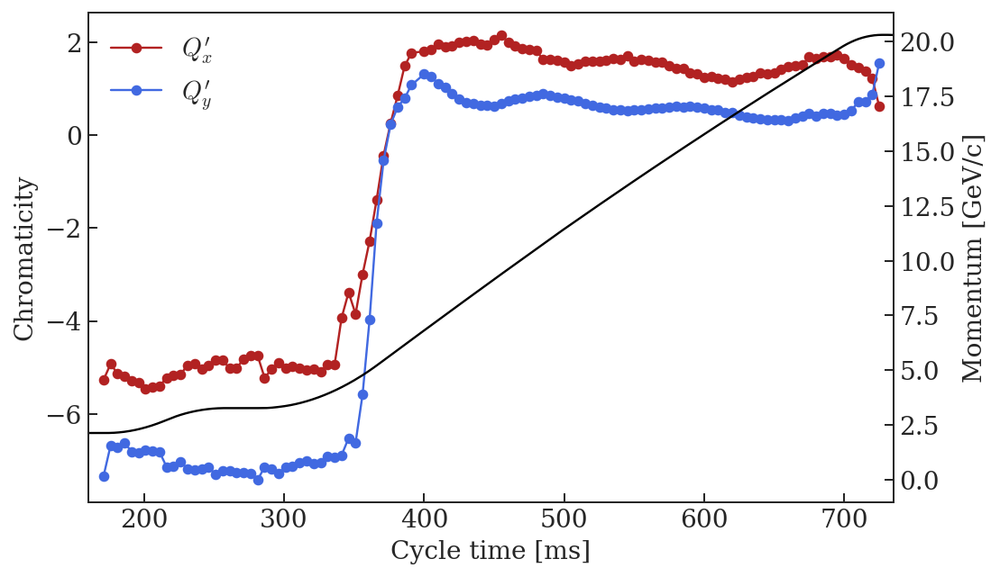
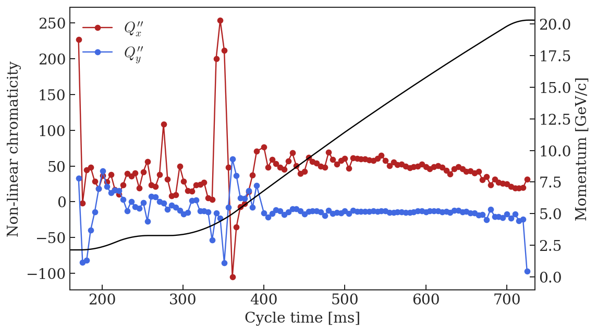
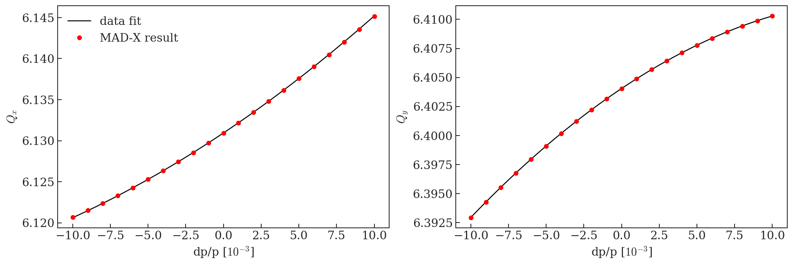

# TOF chromaticity measurements


```python
%run /eos/project/l/liu/Toolbox/myToolbox.py

%config InlineBackend.figure_format = 'retina'

plt.rcParams["mathtext.fontset"] = "cm"
```

    Version 0.03. This is the latest version.
    Please help me to improve it reporting bugs to guido.sterbini@cern.ch.


    /eos/project/l/liu/Toolbox/myToolbox.py:24: FutureWarning: 'pandas.tseries.converter.register' has been moved and renamed to 'pandas.plotting.register_matplotlib_converters'. 
      converter.register()


    Your platform is Linux-3.10.0-957.21.3.el7.x86_64-x86_64-with-centos-7.6.1810-Core
    Your folder is /eos/user/a/ahuschau/www/chromaticity_measurements
    Your IP is 172.17.0.20
    2019-07-18 13:58:48


# TOF magnetic cycle


```python
TOF = myToolbox.japcMatlabImport('./measurement_data/TOF/2018.10.29.11.17.42.760.mat')
```


```python
f, ax = plt.subplots(1, figsize = (8,5))

t = np.arange(TOF.PR_BMEAS_B_SD.Samples.value.firstSampleTime, len(TOF.PR_BMEAS_B_SD.Samples.value.samples)*TOF.PR_BMEAS_B_SD.Samples.value.samplingTrain, TOF.PR_BMEAS_B_SD.Samples.value.samplingTrain)
B = TOF.PR_BMEAS_B_SD.Samples.value.samples/1e4
p = TOF.PR_MOMENTUM_ST.Samples.value.samples/1e3
ax.plot(t, B)

ax2 = ax.twinx()
ax2.plot(t, p)

ax2.set_ylabel('Momentum [GeV/c]')

ax.set_xlabel('Cycle time [ms]')
ax.set_ylabel('Magnetic field [T]')

ax.set_xlim(0, 1200)
```


    (0, 1200)





# Chromaticity measurement

These measurements have been performed on 29.10.2018. Below is a screenshot of the entry in the reference logbook. 


```python
file_ = './measurement_data/TOF/before_and_after_transition_hamming_window.csv'
Qxdp, Qx, Qydp, Qy = myToolbox.import_chromaticity(file_)
```


```python
Qx_fit = myToolbox.fit_chromaticity(Qxdp, Qx, 2)
Qy_fit = myToolbox.fit_chromaticity(Qydp, Qy, 2)
```


```python
f, ax = plt.subplots(1, figsize = (8,5))

ax.plot(Qx_fit['time'], Qx_fit['tune'], '-o', color = 'firebrick', label = '$Q_x$')
ax.plot(Qy_fit['time'], Qy_fit['tune'], '-o', color = 'royalblue', label = '$Q_y$')

ax.set_xlabel('Cycle time [ms]')
ax.set_ylabel('Tune')
ax.legend(frameon = False)
ax.set_xlim(160, 735)

ax2 = ax.twinx()
ax2.plot(t, p, 'k')
ax2.set_ylabel('Momentum [GeV/c]')
```


    Text(0,0.5,'Momentum [GeV/c]')





```python
f, ax = plt.subplots(1, figsize = (8,5))

ax.plot(Qx_fit['time'], Qx_fit['chromaticity'], '-o', color = 'firebrick', label = '$Q_x^\prime$')
ax.plot(Qy_fit['time'], Qy_fit['chromaticity'], '-o', color = 'royalblue', label = '$Q_y^\prime$')

ax.set_xlabel('Cycle time [ms]')
ax.set_ylabel('Chromaticity')
ax.legend(frameon = False)
ax.set_xlim(160, 735)

ax2 = ax.twinx()
ax2.plot(t, p, 'k')
ax2.set_ylabel('Momentum [GeV/c]')
```


    Text(0,0.5,'Momentum [GeV/c]')





```python
f, ax = plt.subplots(1, figsize = (8,5))

ax.plot(Qx_fit['time'], Qx_fit['nl_chromaticity'], '-o', color = 'firebrick', label = '$Q_x^{\prime\prime}$')
ax.plot(Qy_fit['time'], Qy_fit['nl_chromaticity'], '-o', color = 'royalblue', label = '$Q_y^{\prime\prime}$')

ax.set_xlabel('Cycle time [ms]')
ax.set_ylabel('Non-linear chromaticity')
ax.legend(frameon = False, loc = 'upper left')
ax.set_xlim(160, 735)

ax2 = ax.twinx()
ax2.plot(t, p, 'k')
ax2.set_ylabel('Momentum [GeV/c]')
```


    Text(0,0.5,'Momentum [GeV/c]')





# Create MAD-X input

## Flat bottom


```python
idx = 0
print('Cycle time: ' + str(Qx_fit['time'].iloc[idx]) + ' ms') 

print('\nOnly the tunes are considered, as the higher orders are assumed to be unchanged wrt. the bare machine.\n')

aux = Qx_fit['coefficients'].iloc[idx]
print('! Qx = ' + str(np.round(aux[2]-6, 5)) + ' + ' + str(np.round(aux[1], 5)) + '*x + ' + str(np.round(aux[0], 5)) + '*x^2')
print('Qx := ' + str(np.round(aux[2]-6, 5)) + ';')
# print('MQx1 := ' + str(np.round(aux[1], 5)) + ';')
# print('MQx2 := ' + str(np.round(aux[0], 5)) + ';')

print('')

aux = Qy_fit['coefficients'].iloc[idx]
print('! Qy = ' + str(np.round(aux[2]-6, 5)) + ' + ' + str(np.round(aux[1], 5)) + '*x + ' + str(np.round(aux[0], 5)) + '*x^2')
print('Qy := ' + str(np.round(aux[2]-6, 5)) + ';')
# print('MQy1 := ' + str(np.round(aux[1], 5)) + ';')
# print('MQy2 := ' + str(np.round(aux[0], 5)) + ';')
```

    Cycle time: 171.0 ms
    
    Only the tunes are considered, as the higher orders are assumed to be unchanged wrt. the bare machine.
    
    ! Qx = 0.13857 + -5.267*x + 226.89812*x^2
    Qx := 0.13857;
    
    ! Qy = 0.34967 + -7.33863*x + 33.33516*x^2
    Qy := 0.34967;


## Flat top (C720)


```python
idx = -2
print('Cycle time: ' + str(Qx_fit['time'].iloc[idx]) + ' ms') 

print('')

aux = Qx_fit['coefficients'].iloc[idx]
print('! Qx = ' + str(aux[2]-6) + ' + ' + str(aux[1]) + '*x + ' + str(aux[0]) + '*x^2')
print('Qx0 := ' + str(aux[2]-6) + ';')
print('Qx1 := ' + str(aux[1]) + ';')
print('Qx2 := ' + str(aux[0]) + ';')

print('')

aux = Qy_fit['coefficients'].iloc[idx]
print('! Qy = ' + str(aux[2]-6) + ' + ' + str(aux[1]) + '*x + ' + str(aux[0]) + '*x^2')
print('Qy0 := ' + str(aux[2]-6) + ';')
print('Qy1 := ' + str(aux[1]) + ';')
print('Qy2 := ' + str(aux[0]) + ';')
```

    Cycle time: 720.0 ms
    
    ! Qx = 0.13093873900141428 + 1.2288084000048434*x + 19.680078828974406*x^2
    Qx0 := 0.13093873900141428;
    Qx1 := 1.2288084000048434;
    Qx2 := 19.680078828974406;
    
    ! Qy = 0.40404914434222494 + 0.8671202036609705*x + -24.305861717530682*x^2
    Qy0 := 0.40404914434222494;
    Qy1 := 0.8671202036609705;
    Qy2 := -24.305861717530682;


# Comparison between MAD-X output and measurements

## Flat top (C720)


```python
mad = metaclass.twiss('/eos/user/a/ahuschau/www/PS/2019/scenarios/TOF/2_flat_top/PS_FT_TOF_chromaticity_summary.out')

f, ax = plt.subplots(1,2, figsize = (16, 5))

p = np.poly1d(Qx_fit['coefficients'].iloc[-2])
dp = np.linspace(-0.01, 0.01, 100)
ax[0].plot(dp*1e3, p(dp), 'k', label = 'data fit')
ax[0].plot(mad.DP0*1e3, mad.QX+6, 'or', label = 'MAD-X result')
ax[0].legend(frameon = False)

p = np.poly1d(Qy_fit['coefficients'].iloc[-2])
dp = np.linspace(-0.01, 0.01, 100)
ax[1].plot(dp*1e3, p(dp), 'k')
ax[1].plot(mad.DP0*1e3, mad.QY+6, 'or')

ylabel = ['$Q_x$', '$Q_y$']
for i in xrange(2):
    ax[i].set_xlabel('dp/p [$10^{-3}$]')
    ax[i].set_ylabel(ylabel[i])
```

    alllabels 4





```python
!jupyter nbconvert --to markdown --output-dir='../test-acc-models/repository/PS/2019/scenarios/TOF/' TOF_chromaticity_measurement.ipynb
```

    [NbConvertApp] Converting notebook TOF_chromaticity_measurement.ipynb to markdown
    [NbConvertApp] Support files will be in TOF_chromaticity_measurement_files/
    [NbConvertApp] Making directory ../test-acc-models/repository/PS/2019/scenarios/TOF/TOF_chromaticity_measurement_files
    [NbConvertApp] Making directory ../test-acc-models/repository/PS/2019/scenarios/TOF/TOF_chromaticity_measurement_files
    [NbConvertApp] Making directory ../test-acc-models/repository/PS/2019/scenarios/TOF/TOF_chromaticity_measurement_files
    [NbConvertApp] Making directory ../test-acc-models/repository/PS/2019/scenarios/TOF/TOF_chromaticity_measurement_files
    [NbConvertApp] Making directory ../test-acc-models/repository/PS/2019/scenarios/TOF/TOF_chromaticity_measurement_files
    [NbConvertApp] Writing 7749 bytes to ../test-acc-models/repository/PS/2019/scenarios/TOF/TOF_chromaticity_measurement.md

