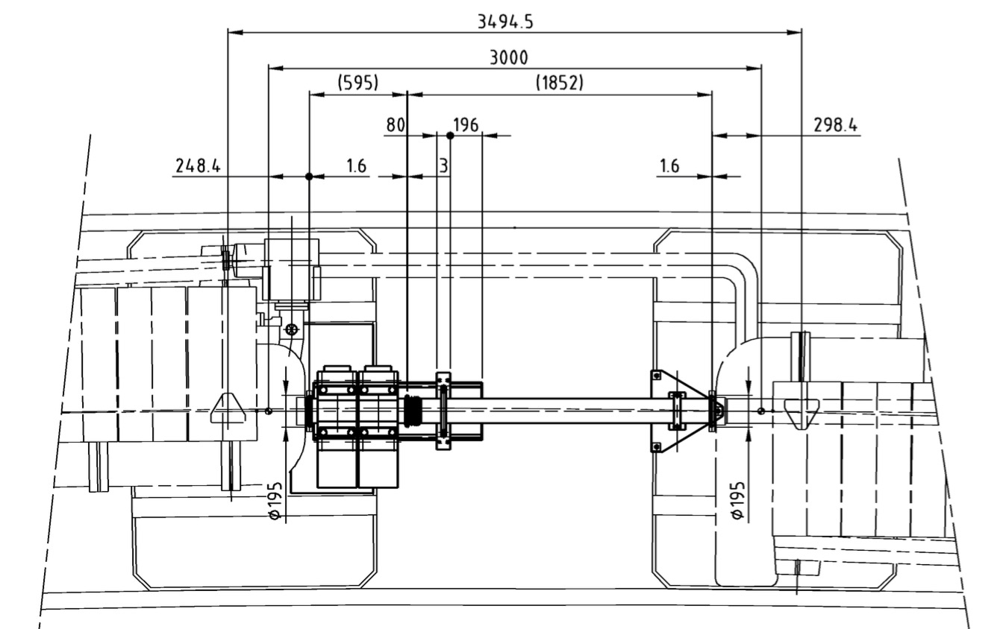
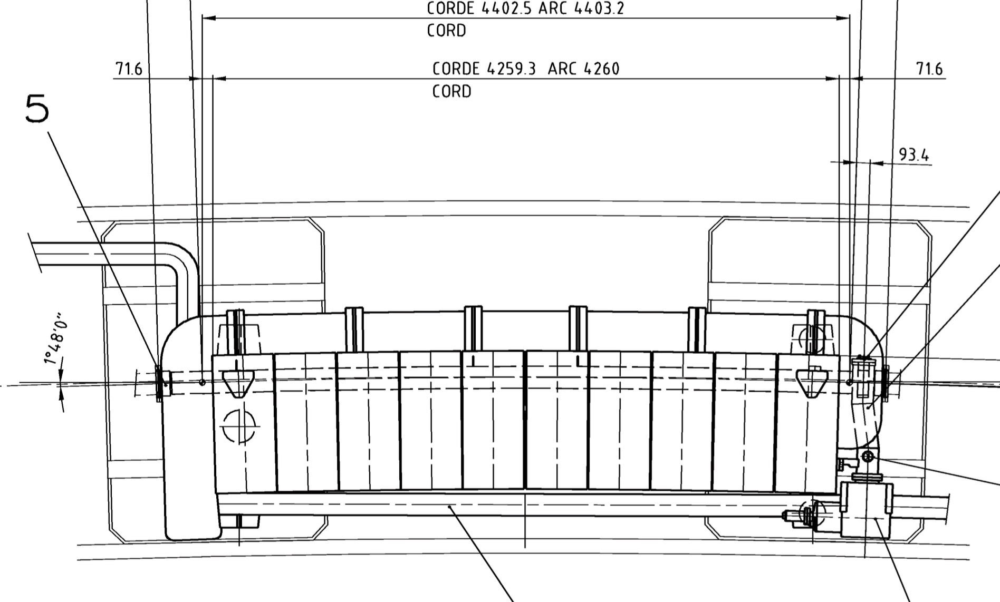
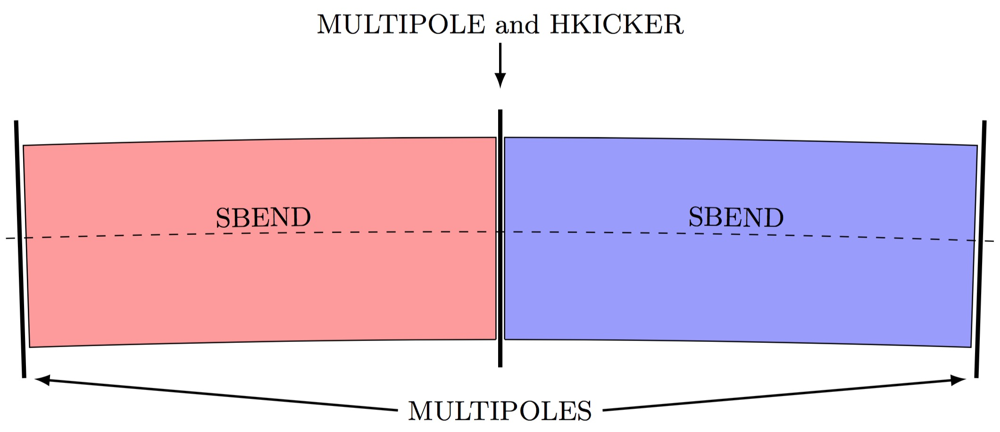
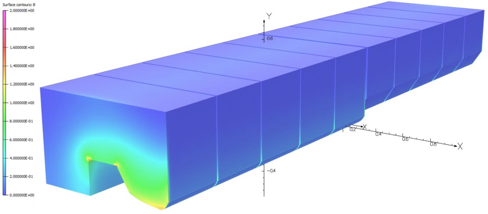
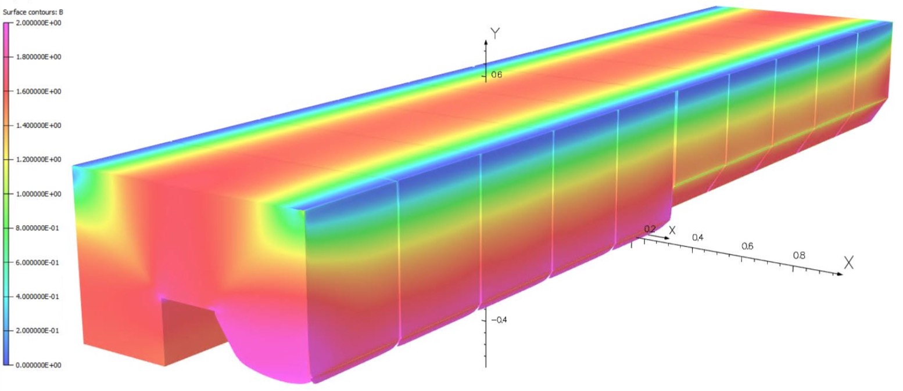
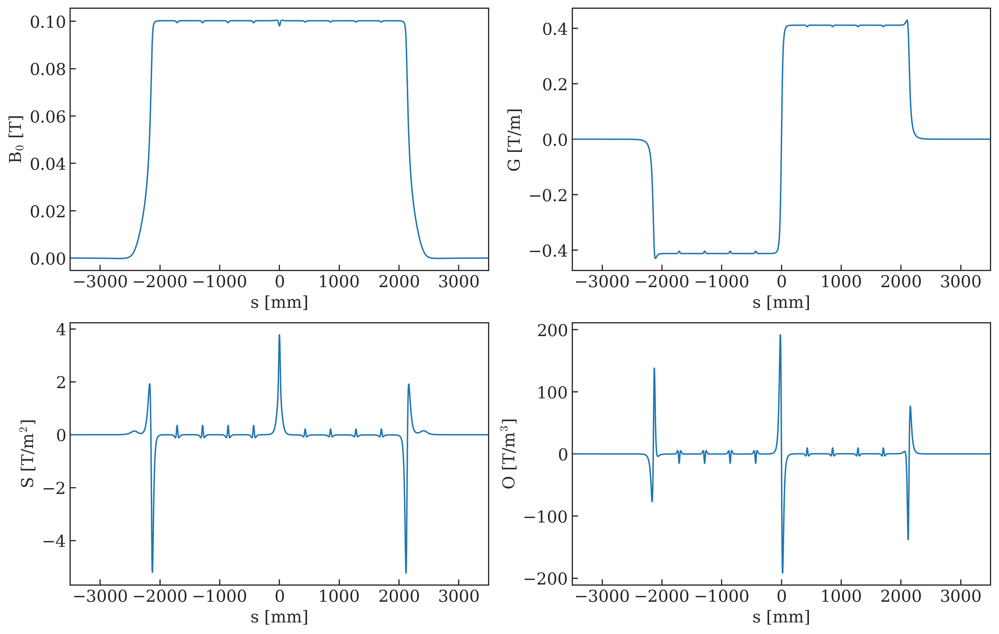
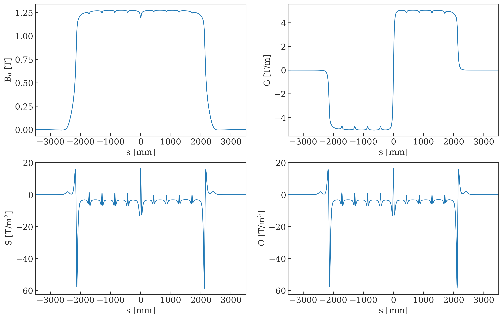

<h1> The new optics model for the PS </h1>

<h2> Layout of the lattice </h2>

Over the last years an effort has been ongoing to extract the PS sequence directly from the layout database (LDB). This is especially complex given the structure of the lattice, i.e. the use of combined function magnets.
Therefore, it has been decided to only extract the sequence of straight section elements from LDB (under the responsibility of EN-ACE), while the responsibility for the sequence of the PS main magnets remains with BE-ABP.

The main difference with respect to the old PS optics model (in use until ~ mid-2019) lies in a new definition of the layout of the straight sections (SSs) and, consequently, the main units (MUs).
In the following, the most important aspects are described.

In 1972 H. Umst&auml;tter nicely described in [this document](https://edms.cern.ch/document/2026379/0.1){target=_blank} the considerations on the nominal PS layout. The nominal PS circumference is 

$$
\mathcal{C}_{\rm PS} = 2 \, \pi \, 100 = 628.3185 \, {\rm m}
$$

including 20 SSs of 3.0 m and 80 SSs of 1.6 m length, accounting for a total of 188 m. 
Consequently, each of the 100 combined function MUs has a magnetic length of 

$$
l_{\rm MU, mag} = 4.403185 \, {\rm m}
$$ 

and the bending radius of the PS is

$$
\rho_{\rm PS} = 70.0789 \, {\rm m}.
$$

The layout of the new PS optics model adheres to these definitions and, as a result, the drift space inbetween the main coils (where either the low-energy magnets or the BPMs are located), has been incorporated into the SSs.
In order to illustrate the layout, parts of the drawings of SS01 and MU01 are shown in Figs. 1 and 2, respectively.

{: style="width:50%"}

<b>Figure 1:</b> PS straight section 01 (from drawing <a href="https://edms.cern.ch/ui/file/223829/AF/ps_lm___0012-vAF_plt_cpdf.pdf" target=_blank>PS_LM___0012</a>).

Each main unit consists of two half-units, one providing the focusing and the other the defocusing quadrupolar component. 
Each half-unit consists of 5 iron blocks with a length of $l_{\rm block} = 417$ mm. These blocks are aligned with wedge-shaped air gaps inbetween, in order to provide the required bending angle of 3.6 deg per magnet.
These gaps are $l_{\rm gap, F} = 7.75$ mm and $l_{\rm gap, D} = 9.75$ mm wide in the focusing and defocusing part of the magnet, respectively. 
In addition, the two half-units are separated by the junction, with $l_{\rm j} = 20$ mm.

{: style="width:55%"}

<b>Figure 2:</b> PS main unit 01 (from drawing <a href="https://edms.cern.ch/ui/file/223826/AC/ps_lm___0013-vAC_plt_cpdf.pdf" target=_blank>PS_LM___0013</a>).

The total mechanical length of the focusing and defocusing half-units along the reference trajectory therefore amounts to

$$
l_{\rm F} = 5 \times l_{\rm block} + 4 \times l_{\rm gap, F} + \frac{l_{\rm j}}{2} = 2.126 \, {\rm m} \\
l_{\rm D} = 5 \times l_{\rm block} + 4 \times l_{\rm gap, D} + \frac{l_{\rm j}}{2} = 2.134 \, {\rm m}
$$

which leads to a mechanical length of the main magnet of 

$$
l_{\rm MU, mech} = 4.260 \, {\rm m.}
$$

The difference 

$$
\Delta l_{\rm corr} = \frac{l_{\rm MU, mag} - l_{\rm MU, mech}}{2} = 0.0715925 \, {\rm m}
$$

is considered as nominal bending length correction and is added to the length of the half-units in the model.

In MAD-X the combined function magnets are represented as illustrated in Fig. 3. Each half-unit is modelled as SBEND with non-zero quadrupole gradient.
Furthermore, zero-length multipoles are inserted at three locations to model higher order field components (see also following section). 
The central junction also accommodates an HKICKER representing the horizontal orbit correctors (DHZ or backleg windings). 
In reality, the horizontal orbit correction is achieved by an extra winding around the backleg of the yoke, powering always a pair of magnets in series to cancel out the quadrupolar effect.
For example, the DHZ(XX) acts on MU(XX-1) and MU(XX). Therefore, the same kick is always applied to these pairs of DHZs in the model.

{: style="width:55%"}

<b>Figure 3:</b> PS main unit representation in MAD-X. The different colors schematically indicate the different focusing properties.

<h2> Magnetic fields of higher order </h2>

The location of the three multipoles was chosen in the described way to represent the current knowledge of the higher order magnetic components in the best possible way, while keeping the number of elements small to allow efficient long-term tracking simulations.
A 3D magnetic model has been created using OPERA by colleagues from TE-MSC (see <a href="https://edms.cern.ch/document/2140704/2" target=_blank>EDMS 223826</a>) and Figs. 4 and 5 show the obtained field distributions at different energies. 
At flat top saturation effects are clearly visible, especially around the pole tip. 

{: style="width:55%"}

<b>Figure 4:</b> 3D OPERA model of the PS MU at 1.4 GeV (from <a href="https://edms.cern.ch/document/2140704/2" target=_blank>EDMS 223826</a>).

{: style="width:55%"}

<b>Figure 5:</b> 3D OPERA model of the PS MU at 26 GeV (from <a href="https://edms.cern.ch/document/2140704/2" target=_blank>EDMS 223826</a>).

For a given reference radius (25 mm for the figures shown in the following), the harmonic field components can be calculated from the 3D model. 
Figures 6 and 7 show the dipole to octupole components at 1.4 GeV and 26 GeV, respectively. 
Looking at Fig. 6, it is obvious that the sextupole and octupole components are mainly concentrated at the extremeties of the MUs and in the junction between the half-units, which justifies the placement of the multipoles in the optics model.
Concerning the sextupole component one can further remark that the entry and exit contributions are fairly similar and for the octupole component one observes that the integrated contribution around the junction is negligibly small.

These observations are valid in the absence of saturation effects. For energies larger than 23 GeV saturation effects start to become important.
For such energies, higher order magnetic components are also present inside the iron blocks. At the same time, the PFW contribute to the magnetic field there. 
Therefore, two different approaches to match non-linear chromaticity in the model have been chosen:
	
- at low energy (and without PFW) only the multipoles are used for matching.
- at high energy (and if PFW are used such as for the LHC flat bottom configuration) the sextupole component is allocated to the multipoles and the SBENDs. The octupole component however is only included using the multipoles. 

{: style="width:65%"}

<b>Figure 6:</b> Distribution of dipole, quadrupole, sextupole and octupole components along the main magnet at 1.4 GeV. These results were obtained from the OPERA 3D model.

{: style="width:65%"}

<b>Figure 7:</b> Distribution of dipole, quadrupole, sextupole and octupole components along the main magnet at 26 GeV. These results were obtained from the OPERA 3D model.

